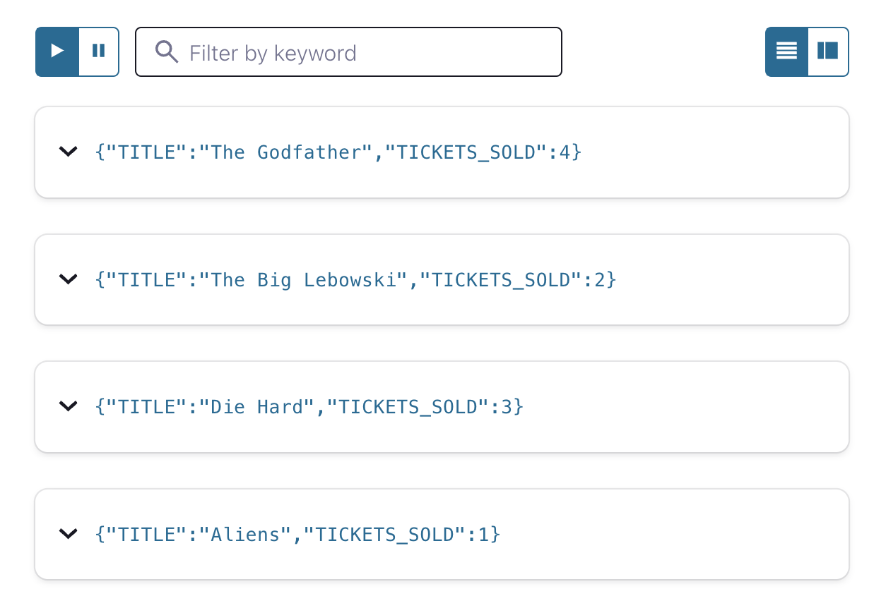

#  Aggregations - counting

This tutorial takes a stream of individual movie ticket sales events and counts the total number of tickets sold per movie. Not all ticket prices are the same (apparently some of these theaters are fancier than others), but the task of the ksqlDB query is just to group and count regardless of ticket price.

## Setup

First we need to create a stream of ticket sales. This line of ksqlDB DDL creates a stream and its underlying Kafka topic to represent 
the annual sales totals. If the topic already exists, then ksqlDB simply registers it as the source of data underlying the new stream. 
The stream has three fields: `title`, the name of the movie; `sale_ts`, the time at which the ticket was sold; and 
`ticket_total_value`, the price paid for the ticket. The statement also specifies the underlying Kafka topic as `movie-ticket-sales`, 
that it should have a single partition, and defines Avro as its data format.

```sql
CREATE STREAM MOVIE_TICKET_SALES (title VARCHAR, sale_ts VARCHAR, ticket_total_value INT)
    WITH (KAFKA_TOPIC='movie-ticket-sales',
          PARTITIONS=1,
          VALUE_FORMAT='avro');
```


Before we get too far, let’s set the `auto.offset.reset` configuration parameter to earliest. This means all new ksqlDB queries will
automatically compute their results from the beginning of a stream, rather than the end. This isn’t always what you’ll want to do in
production, but it makes query results much easier to see in examples like this.

`SET 'auto.offset.reset' = 'earliest';`
For the purposes of this tutorial only, we are also going to configure ksqlDB to 
buffer the aggregates as it builds them. This makes the query feel like it responds more slowly,
but means that you get just one row per movie from which it is simpler to understand the concept:

`SET 'ksql.streams.cache.max.bytes.buffering' = '10000000';`

## Computing the count

Now that you have your stream the next step is to create a table for performing a count of the number of movie tickets.

```sql
CREATE TABLE MOVIE_TICKETS_SOLD AS 
    SELECT TITLE, 
           COUNT(TICKET_TOTAL_VALUE) AS TICKETS_SOLD
    FROM MOVIE_TICKET_SALES
    GROUP BY TITLE
    EMIT CHANGES;
```

## Running the example

You can run the example backing this tutorial in one of two ways:  locally with the ksqlDB CLI 
against Kafka running in Docker, or with Confluent Cloud.

<details>
  <summary>ksqlDB CLI </summary>

#### Prerequisites

* Docker running via [Docker Desktop](https://docs.docker.com/desktop/) or [Docker Engine](https://docs.docker.com/engine/install/)
* [Docker Compose](https://docs.docker.com/compose/install/). Ensure that the command `docker compose version` succeeds.

#### Run the commands

First, start ksqlDB and Kafka:

  ```shell
  docker compose -f ./docker/docker-compose-ksqldb.yml up -d
  ```
Next, open the ksqlDB CLI:

  ```shell
  docker exec -it ksqldb-cli ksql http://ksqldb-server:8088
  ```

Finally, run following SQL statements to create the `MOVIE_TICKET_SALES` stream backed by Kafka running in Docker, populate it with
test data, and run the aggregating count query.

```sql
CREATE STREAM MOVIE_TICKET_SALES (title VARCHAR, sale_ts VARCHAR, ticket_total_value INT)
    WITH (KAFKA_TOPIC='movie-ticket-sales',
          PARTITIONS=1,
          VALUE_FORMAT='avro');
```


```sql
INSERT INTO MOVIE_TICKET_SALES (title, sale_ts, ticket_total_value) VALUES ('Aliens', '2019-07-18T10:00:00Z', 10);
INSERT INTO MOVIE_TICKET_SALES (title, sale_ts, ticket_total_value) VALUES ('Die Hard', '2019-07-18T10:00:00Z', 12);
INSERT INTO MOVIE_TICKET_SALES (title, sale_ts, ticket_total_value) VALUES ('Die Hard', '2019-07-18T10:01:00Z', 12);
INSERT INTO MOVIE_TICKET_SALES (title, sale_ts, ticket_total_value) VALUES ('The Godfather', '2019-07-18T10:01:31Z', 12);
INSERT INTO MOVIE_TICKET_SALES (title, sale_ts, ticket_total_value) VALUES ('Die Hard', '2019-07-18T10:01:36Z', 24);
INSERT INTO MOVIE_TICKET_SALES (title, sale_ts, ticket_total_value) VALUES ('The Godfather', '2019-07-18T10:02:00Z', 18);
INSERT INTO MOVIE_TICKET_SALES (title, sale_ts, ticket_total_value) VALUES ('The Big Lebowski', '2019-07-18T11:03:21Z', 12);
INSERT INTO MOVIE_TICKET_SALES (title, sale_ts, ticket_total_value) VALUES ('The Big Lebowski', '2019-07-18T11:03:50Z', 12);
INSERT INTO MOVIE_TICKET_SALES (title, sale_ts, ticket_total_value) VALUES ('The Godfather', '2019-07-18T11:40:00Z', 36);
INSERT INTO MOVIE_TICKET_SALES (title, sale_ts, ticket_total_value) VALUES ('The Godfather', '2019-07-18T11:40:09Z', 18);
```

```sql
CREATE TABLE MOVIE_TICKETS_SOLD AS 
    SELECT TITLE, 
           COUNT(TICKET_TOTAL_VALUE) AS TICKETS_SOLD
    FROM MOVIE_TICKET_SALES
    GROUP BY TITLE
    EMIT CHANGES;
```

```sql
 select * from MOVIE_TICKETS_SOLD EMIT CHANGES;
```

The query output should look like this:

  ```plaintext
+--------------------+--------------------+
|TITLE               |TICKETS_SOLD        |
+--------------------+--------------------+
|Aliens              |1                   |
|Die Hard            |3                   |
|The Big Lebowski    |2                   |
 ```
When you are finished, clean up the containers used for this tutorial by running:

  ```shell
  docker compose -f ./docker/docker-compose-ksqldb.yml down -v
  ```
</details>

<details>
<summary> Confluent Cloud </summary>

#### Prerequisites

* A [Confluent Cloud](https://confluent.cloud/signup) account
* A ksqlDB cluster created in Confluent Cloud. Follow [this quick start](https://docs.confluent.io/cloud/current/get-started/index.html#section-2-add-ksql-cloud-to-the-cluster) to create one.

#### Run the commands

In the Confluent Cloud Console, navigate to your environment and then click the `ksqlDB` link from left-side menu. Then click on the 
name of ksqlDB cluster you created.

Finally, run following SQL statements in the ksqlDB UI `Editor` tab  to create the `MOVIE_TICKET_SALES` stream, populate it with
test data, and run the aggregating count query.

```sql
CREATE STREAM MOVIE_TICKET_SALES (title VARCHAR, sale_ts VARCHAR, ticket_total_value INT)
    WITH (KAFKA_TOPIC='movie-ticket-sales',
          PARTITIONS=1,
          VALUE_FORMAT='avro');
```


```sql
INSERT INTO MOVIE_TICKET_SALES (title, sale_ts, ticket_total_value) VALUES ('Aliens', '2019-07-18T10:00:00Z', 10);
INSERT INTO MOVIE_TICKET_SALES (title, sale_ts, ticket_total_value) VALUES ('Die Hard', '2019-07-18T10:00:00Z', 12);
INSERT INTO MOVIE_TICKET_SALES (title, sale_ts, ticket_total_value) VALUES ('Die Hard', '2019-07-18T10:01:00Z', 12);
INSERT INTO MOVIE_TICKET_SALES (title, sale_ts, ticket_total_value) VALUES ('The Godfather', '2019-07-18T10:01:31Z', 12);
INSERT INTO MOVIE_TICKET_SALES (title, sale_ts, ticket_total_value) VALUES ('Die Hard', '2019-07-18T10:01:36Z', 24);
INSERT INTO MOVIE_TICKET_SALES (title, sale_ts, ticket_total_value) VALUES ('The Godfather', '2019-07-18T10:02:00Z', 18);
INSERT INTO MOVIE_TICKET_SALES (title, sale_ts, ticket_total_value) VALUES ('The Big Lebowski', '2019-07-18T11:03:21Z', 12);
INSERT INTO MOVIE_TICKET_SALES (title, sale_ts, ticket_total_value) VALUES ('The Big Lebowski', '2019-07-18T11:03:50Z', 12);
INSERT INTO MOVIE_TICKET_SALES (title, sale_ts, ticket_total_value) VALUES ('The Godfather', '2019-07-18T11:40:00Z', 36);
INSERT INTO MOVIE_TICKET_SALES (title, sale_ts, ticket_total_value) VALUES ('The Godfather', '2019-07-18T11:40:09Z', 18);
```

```sql
CREATE TABLE MOVIE_TICKETS_SOLD AS 
    SELECT TITLE, 
           COUNT(TICKET_TOTAL_VALUE) AS TICKETS_SOLD
    FROM MOVIE_TICKET_SALES
    GROUP BY TITLE
    EMIT CHANGES;
```

```sql
 select * from MOVIE_TICKETS_SOLD EMIT CHANGES;
```

The query output should look like this:


</details>


