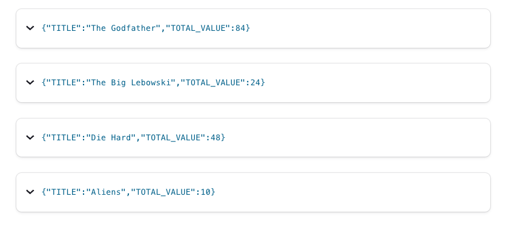

# Aggregations - sum

Suppose you have a topic with events that represent ticket sales for movies. Each event contains the movie that the ticket was purchased for, as well as its price. In this tutorial, we'll write a program that calculates the sum of all ticket sales per movie.


## Setup

First we need to create a stream of ticket sales. This line of ksqlDB DDL creates a stream and its underlying Kafka topic `movie-ticket-sales` to represent
the ticket sale event. If the topic already exists, then ksqlDB simply registers it as the source of data underlying the new stream.
The stream has three fields: `title`, the name of the movie; `sale_ts`, the timestamp of the purchase; and
`ticket_total_value`, the amount paid for the ticket.  Another important characteristic of the data is the timestamp column, `sale_ts`. Every message in Kafka is timestamped, and unless you specify otherwise, ksqlDB will use that existing timestamp for any time-related processing. 
In this tutorial, we’re telling it to use a field in the message for the timestamp. 

```sql
 CREATE STREAM MOVIE_TICKET_SALES (title VARCHAR, sale_ts VARCHAR, ticket_total_value INT)
    WITH (KAFKA_TOPIC='movie-ticket-sales',
          PARTITIONS=1,
          VALUE_FORMAT='avro',
          TIMESTAMP='sale_ts',
          TIMESTAMP_FORMAT='yyyy-MM-dd''T''HH:mm:ssX');
```

Before we get too far, let’s set the `auto.offset.reset` configuration parameter to earliest. This means all new ksqlDB queries will
automatically compute their results from the beginning of a stream, rather than the end. This isn’t always what you’ll want to do in
production, but it makes query results much easier to see in examples like this.

`SET 'auto.offset.reset' = 'earliest';`
For the purposes of this tutorial only, we are also going to configure ksqlDB to
buffer the aggregates as it builds them. This makes the query feel like it responds more slowly,
but means that you get just one row per movie from which it is simpler to understand the concept:

`SET 'ksql.streams.cache.max.bytes.buffering' = '10000000';`

## Computing the sum

Now that you have your stream the next step is to create a table for performing the sum of sales per movie title.

```sql
CREATE TABLE MOVIE_REVENUE AS
SELECT TITLE,
       SUM(TICKET_TOTAL_VALUE) AS TOTAL_VALUE
FROM MOVIE_TICKET_SALES
GROUP BY TITLE;
```

## Running the example

<details>
  <summary>ksqlDB CLI </summary>

#### Prerequisites

* Docker running via [Docker Desktop](https://docs.docker.com/desktop/) or [Docker Engine](https://docs.docker.com/engine/install/)
* [Docker Compose](https://docs.docker.com/compose/install/). Ensure that the command `docker compose version` succeeds.

#### Run the commands

First, start ksqlDB and Kafka:

  ```shell
  docker compose -f ./docker/docker-compose-ksqldb.yml up -d
  ```
Next, open the ksqlDB CLI:

  ```shell
  docker exec -it ksqldb-cli ksql http://ksqldb-server:8088
  ```

Finally, run following SQL statements to create the `MOVIE_TICKET_SALES` stream backed by Kafka running in Docker, populate it with
test data, and run the aggregating sum query.

```sql
 CREATE STREAM MOVIE_TICKET_SALES (title VARCHAR, sale_ts VARCHAR, ticket_total_value INT)
    WITH (KAFKA_TOPIC='movie-ticket-sales',
          PARTITIONS=1,
          VALUE_FORMAT='avro',
          TIMESTAMP='sale_ts',
          TIMESTAMP_FORMAT='yyyy-MM-dd''T''HH:mm:ssX');
```
```sql
INSERT INTO MOVIE_TICKET_SALES (title, sale_ts, ticket_total_value) VALUES ('Aliens',           FORMAT_TIMESTAMP(FROM_UNIXTIME(UNIX_TIMESTAMP()), 'yyyy-MM-dd''T''HH:mm:ssX'), 10);
INSERT INTO MOVIE_TICKET_SALES (title, sale_ts, ticket_total_value) VALUES ('Die Hard',         FORMAT_TIMESTAMP(FROM_UNIXTIME(UNIX_TIMESTAMP()), 'yyyy-MM-dd''T''HH:mm:ssX'), 12);
INSERT INTO MOVIE_TICKET_SALES (title, sale_ts, ticket_total_value) VALUES ('Die Hard',         FORMAT_TIMESTAMP(FROM_UNIXTIME(UNIX_TIMESTAMP()), 'yyyy-MM-dd''T''HH:mm:ssX'), 12);
INSERT INTO MOVIE_TICKET_SALES (title, sale_ts, ticket_total_value) VALUES ('The Godfather',    FORMAT_TIMESTAMP(FROM_UNIXTIME(UNIX_TIMESTAMP()), 'yyyy-MM-dd''T''HH:mm:ssX'), 12);
INSERT INTO MOVIE_TICKET_SALES (title, sale_ts, ticket_total_value) VALUES ('Die Hard',         FORMAT_TIMESTAMP(FROM_UNIXTIME(UNIX_TIMESTAMP()), 'yyyy-MM-dd''T''HH:mm:ssX'), 24);
INSERT INTO MOVIE_TICKET_SALES (title, sale_ts, ticket_total_value) VALUES ('The Godfather',    FORMAT_TIMESTAMP(FROM_UNIXTIME(UNIX_TIMESTAMP()), 'yyyy-MM-dd''T''HH:mm:ssX'), 18);
INSERT INTO MOVIE_TICKET_SALES (title, sale_ts, ticket_total_value) VALUES ('The Big Lebowski', FORMAT_TIMESTAMP(FROM_UNIXTIME(UNIX_TIMESTAMP()), 'yyyy-MM-dd''T''HH:mm:ssX'), 12);
INSERT INTO MOVIE_TICKET_SALES (title, sale_ts, ticket_total_value) VALUES ('The Big Lebowski', FORMAT_TIMESTAMP(FROM_UNIXTIME(UNIX_TIMESTAMP()), 'yyyy-MM-dd''T''HH:mm:ssX'), 12);
INSERT INTO MOVIE_TICKET_SALES (title, sale_ts, ticket_total_value) VALUES ('The Godfather',    FORMAT_TIMESTAMP(FROM_UNIXTIME(UNIX_TIMESTAMP()), 'yyyy-MM-dd''T''HH:mm:ssX'), 36);
INSERT INTO MOVIE_TICKET_SALES (title, sale_ts, ticket_total_value) VALUES ('The Godfather',    FORMAT_TIMESTAMP(FROM_UNIXTIME(UNIX_TIMESTAMP()), 'yyyy-MM-dd''T''HH:mm:ssX'), 18);
```
Note that for the `INSERT` statements you're using `FORMAT_TIMESTAMP(FROM_UNIXTIME(UNIX_TIMESTAMP()), 'yyyy-MM-dd''T''HH:mm:ssX')` vs. hard-coded values because when ksqlDB creates the topics, they have a default retention value of 7 days.  Since this tutorial is a static resource, we'll always want to insert current timestamps, otherwise you'll get unexpected results.

```sql
CREATE TABLE MOVIE_REVENUE AS
SELECT TITLE,
       SUM(TICKET_TOTAL_VALUE) AS TOTAL_VALUE
FROM MOVIE_TICKET_SALES
GROUP BY TITLE;
```

```sql
 SELECT * from MOVIE_REVENUE EMIT CHANGES;
```

The query output should look something like this:

```plaintext
+--------------------+--------------------+
|TITLE               |TOTAL_VALUE         |
+--------------------+--------------------+
|Aliens              |10                  |
|Die Hard            |48                  |
|The Big Lebowski    |24                  |
|The Godfather       |84                  |
 ```
When you are finished, clean up the containers used for this tutorial by running:

  ```shell
  docker compose -f ./docker/docker-compose-ksqldb.yml down -v
  ```
</details>

<details>
<summary> Confluent Cloud </summary>

#### Prerequisites

* A [Confluent Cloud](https://confluent.cloud/signup) account
* A ksqlDB cluster created in Confluent Cloud. Follow [this quick start](https://docs.confluent.io/cloud/current/get-started/index.html#section-2-add-ksql-cloud-to-the-cluster) to create one.

#### Run the commands

In the Confluent Cloud Console, navigate to your environment and then click the `ksqlDB` link from left-side menu. Then click on the
name of ksqlDB cluster you created.

Finally, run following SQL statements in the ksqlDB UI `Editor` tab  to create the `MOVIE_TICKET_SALES` stream, populate it with
test data, and run the aggregating sum query.

```sql
 CREATE STREAM MOVIE_TICKET_SALES (title VARCHAR, sale_ts VARCHAR, ticket_total_value INT)
    WITH (KAFKA_TOPIC='movie-ticket-sales',
          PARTITIONS=1,
          VALUE_FORMAT='avro',
          TIMESTAMP='sale_ts',
          TIMESTAMP_FORMAT='yyyy-MM-dd''T''HH:mm:ssX');
```
```sql
INSERT INTO MOVIE_TICKET_SALES (title, sale_ts, ticket_total_value) VALUES ('Aliens',           FORMAT_TIMESTAMP(FROM_UNIXTIME(UNIX_TIMESTAMP()), 'yyyy-MM-dd''T''HH:mm:ssX'), 10);
INSERT INTO MOVIE_TICKET_SALES (title, sale_ts, ticket_total_value) VALUES ('Die Hard',         FORMAT_TIMESTAMP(FROM_UNIXTIME(UNIX_TIMESTAMP()), 'yyyy-MM-dd''T''HH:mm:ssX'), 12);
INSERT INTO MOVIE_TICKET_SALES (title, sale_ts, ticket_total_value) VALUES ('Die Hard',         FORMAT_TIMESTAMP(FROM_UNIXTIME(UNIX_TIMESTAMP()), 'yyyy-MM-dd''T''HH:mm:ssX'), 12);
INSERT INTO MOVIE_TICKET_SALES (title, sale_ts, ticket_total_value) VALUES ('The Godfather',    FORMAT_TIMESTAMP(FROM_UNIXTIME(UNIX_TIMESTAMP()), 'yyyy-MM-dd''T''HH:mm:ssX'), 12);
INSERT INTO MOVIE_TICKET_SALES (title, sale_ts, ticket_total_value) VALUES ('Die Hard',         FORMAT_TIMESTAMP(FROM_UNIXTIME(UNIX_TIMESTAMP()), 'yyyy-MM-dd''T''HH:mm:ssX'), 24);
INSERT INTO MOVIE_TICKET_SALES (title, sale_ts, ticket_total_value) VALUES ('The Godfather',    FORMAT_TIMESTAMP(FROM_UNIXTIME(UNIX_TIMESTAMP()), 'yyyy-MM-dd''T''HH:mm:ssX'), 18);
INSERT INTO MOVIE_TICKET_SALES (title, sale_ts, ticket_total_value) VALUES ('The Big Lebowski', FORMAT_TIMESTAMP(FROM_UNIXTIME(UNIX_TIMESTAMP()), 'yyyy-MM-dd''T''HH:mm:ssX'), 12);
INSERT INTO MOVIE_TICKET_SALES (title, sale_ts, ticket_total_value) VALUES ('The Big Lebowski', FORMAT_TIMESTAMP(FROM_UNIXTIME(UNIX_TIMESTAMP()), 'yyyy-MM-dd''T''HH:mm:ssX'), 12);
INSERT INTO MOVIE_TICKET_SALES (title, sale_ts, ticket_total_value) VALUES ('The Godfather',    FORMAT_TIMESTAMP(FROM_UNIXTIME(UNIX_TIMESTAMP()), 'yyyy-MM-dd''T''HH:mm:ssX'), 36);
INSERT INTO MOVIE_TICKET_SALES (title, sale_ts, ticket_total_value) VALUES ('The Godfather',    FORMAT_TIMESTAMP(FROM_UNIXTIME(UNIX_TIMESTAMP()), 'yyyy-MM-dd''T''HH:mm:ssX'), 18);
```
Note that for the `INSERT` statements you're using `FORMAT_TIMESTAMP(FROM_UNIXTIME(UNIX_TIMESTAMP()), 'yyyy-MM-dd''T''HH:mm:ssX')` vs. hard-coded values because when ksqlDB creates the topics, they have a default retention value of 7 days.  Since this tutorial is a static resource, we'll always want to insert current timestamps, otherwise you'll get unexpected results.

```sql
CREATE TABLE MOVIE_REVENUE AS
SELECT TITLE,
       SUM(TICKET_TOTAL_VALUE) AS TOTAL_VALUE
FROM MOVIE_TICKET_SALES
GROUP BY TITLE;
```

```sql
 SELECT * from MOVIE_REVENUE EMIT CHANGES;
```

The query output should look like this:



</details>