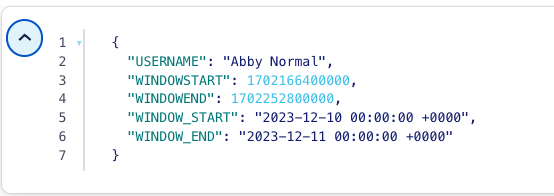

# Anomaly Detection

This tutorial gives examples of using a Stream-Table join to populate a table and then use windowing on the result table.  The use case for this tutorial 
is alerting of suspicious financial transactions over a 24-hour period.

## Setup

First, we'll need to create a stream of transactions:

```sql
CREATE STREAM transactions (TXN_ID BIGINT, USERNAME VARCHAR, RECIPIENT VARCHAR, AMOUNT DOUBLE, TS VARCHAR)
    WITH (kafka_topic='transactions',
          partitions=1,
          value_format='JSON',
          timestamp='TS',
          timestamp_format = 'yyyy-MM-dd HH:mm:ss');
```

Then create a table of known suspicious names:

```sql
CREATE TABLE suspicious_names (CREATED_TS VARCHAR,
                               COMPANY_NAME VARCHAR PRIMARY KEY,
                               COMPANY_ID INT)
    WITH (kafka_topic='suspicious_names',
          partitions=1,
          value_format='JSON',
          timestamp='CREATED_TS',
          timestamp_format = 'yyyy-MM-dd HH:mm:ss');
```

Now create the `TABLE` `suspicious_transactions` by joining the `transactions` `STREAM` with the `suspicious_accounts` `TABLE`

```sql
CREATE STREAM suspicious_transactions
    WITH (kafka_topic='suspicious_transactions', partitions=1, value_format='JSON') AS
    SELECT T.TXN_ID, T.USERNAME, T.RECIPIENT, T.AMOUNT, T.TS
    FROM transactions T
    INNER JOIN
    suspicious_names S
    ON T.RECIPIENT = S.COMPANY_NAME;
```

## Windowing the suspicious account activity
 
Then we'll wrap it all up in a table that captures activity with 3 or more suspicious transactions in a 24-hour period

```sql
CREATE TABLE accounts_to_monitor
    WITH (kafka_topic='accounts_to_monitor', partitions=1, value_format='JSON') AS
    SELECT TIMESTAMPTOSTRING(WINDOWSTART, 'yyyy-MM-dd HH:mm:ss Z') AS WINDOW_START, 
           TIMESTAMPTOSTRING(WINDOWEND, 'yyyy-MM-dd HH:mm:ss Z') AS WINDOW_END,
           USERNAME
    FROM suspicious_transactions
    WINDOW TUMBLING (SIZE 24 HOURS) 
    GROUP BY USERNAME
    HAVING COUNT(*) > 3;
```
The fields `WINDOW_START` and `WINDOW_END` tell us the time interval during which suspicious activity occurred. The `WINDOW TUMBLING` part of the query 
allows us to do an aggregation with distinct time boundaries. 
In this case, our window is fixed at a length of 24 hours, does not allow gaps, and does not allow overlapping.

## Running the example

<details>
  <summary>ksqlDB CLI </summary>

#### Prerequisites

* Docker running via [Docker Desktop](https://docs.docker.com/desktop/) or [Docker Engine](https://docs.docker.com/engine/install/)
* [Docker Compose](https://docs.docker.com/compose/install/). Ensure that the command `docker compose version` succeeds.

#### Run the commands

First, start ksqlDB and Kafka:

  ```shell
  docker compose -f ./docker/docker-compose-ksqldb.yml up -d
  ```
Next, open the ksqlDB CLI:

  ```shell
  docker exec -it ksqldb-cli ksql http://ksqldb-server:8088
  ```

Create the stream and table and populate them with data:

```sql
CREATE STREAM transactions (TXN_ID BIGINT, USERNAME VARCHAR, RECIPIENT VARCHAR, AMOUNT DOUBLE, TS VARCHAR)
    WITH (kafka_topic='transactions',
          partitions=1,
          value_format='JSON',
          timestamp='TS',
          timestamp_format = 'yyyy-MM-dd HH:mm:ss');
```

```sql
CREATE TABLE suspicious_names (CREATED_TS VARCHAR,
                               COMPANY_NAME VARCHAR PRIMARY KEY,
                               COMPANY_ID INT)
    WITH (kafka_topic='suspicious_names',
          partitions=1,
          value_format='JSON',
          timestamp='CREATED_TS',
          timestamp_format = 'yyyy-MM-dd HH:mm:ss');
```

```sql
INSERT INTO transactions (TXN_ID, USERNAME, RECIPIENT, AMOUNT, TS) VALUES (9900, 'Abby Normal', 'Verizon', 22.0, FORMAT_TIMESTAMP(FROM_UNIXTIME(UNIX_TIMESTAMP() - (1 * 24 * 60 * 60 * 1000 + 2 * 60 * 1000)),'yyyy-MM-dd HH:mm:ss'));
INSERT INTO transactions (TXN_ID, USERNAME, RECIPIENT, AMOUNT, TS) VALUES (12, 'Victor von Frankenstein', 'Tattered Cover', 7.0, FORMAT_TIMESTAMP(FROM_UNIXTIME(UNIX_TIMESTAMP() - (1 * 24 * 60 * 60 * 1000 + 3 * 60 * 1000)),'yyyy-MM-dd HH:mm:ss'));
INSERT INTO transactions (TXN_ID, USERNAME, RECIPIENT, AMOUNT, TS) VALUES (13, 'Frau Blücher', 'Peebles', 70.0, FORMAT_TIMESTAMP(FROM_UNIXTIME(UNIX_TIMESTAMP() - (1 * 24 * 60 * 60 * 1000 + 4 * 60 * 1000)),'yyyy-MM-dd HH:mm:ss'));
INSERT INTO transactions (TXN_ID, USERNAME, RECIPIENT, AMOUNT, TS) VALUES (9903, 'Abby Normal', 'Verizon', 61.0, FORMAT_TIMESTAMP(FROM_UNIXTIME(UNIX_TIMESTAMP() - (1 * 24 * 60 * 60 * 1000 + 5 * 60 * 1000)),'yyyy-MM-dd HH:mm:ss'));
INSERT INTO transactions (TXN_ID, USERNAME, RECIPIENT, AMOUNT, TS) VALUES (9901, 'Abby Normal', 'Spirit Halloween', 83.0, FORMAT_TIMESTAMP(FROM_UNIXTIME(UNIX_TIMESTAMP() - (1 * 24 * 60 * 60 * 1000 + 6 * 60 * 1000)),'yyyy-MM-dd HH:mm:ss'));
INSERT INTO transactions (TXN_ID, USERNAME, RECIPIENT, AMOUNT, TS) VALUES (9902, 'Abby Normal', 'Spirit Halloween', 46.0, FORMAT_TIMESTAMP(FROM_UNIXTIME(UNIX_TIMESTAMP() - (1 * 24 * 60 * 60 * 1000 + 7 * 60 * 1000)),'yyyy-MM-dd HH:mm:ss'));
INSERT INTO transactions (TXN_ID, USERNAME, RECIPIENT, AMOUNT, TS) VALUES (9904, 'Abby Normal', 'Spirit Halloween', 59.0, FORMAT_TIMESTAMP(FROM_UNIXTIME(UNIX_TIMESTAMP() - (1 * 24 * 60 * 60 * 1000 + 8 * 60 * 1000)),'yyyy-MM-dd HH:mm:ss'));
INSERT INTO transactions (TXN_ID, USERNAME, RECIPIENT, AMOUNT, TS) VALUES (6, 'Victor von Frankenstein', 'Confluent Cloud', 21.0, FORMAT_TIMESTAMP(FROM_UNIXTIME(UNIX_TIMESTAMP() - (1 * 24 * 60 * 60 * 1000 + 9 * 60 * 1000)),'yyyy-MM-dd HH:mm:ss'));
INSERT INTO transactions (TXN_ID, USERNAME, RECIPIENT, AMOUNT, TS) VALUES (18, 'Frau Blücher', 'Target', 70.0, FORMAT_TIMESTAMP(FROM_UNIXTIME(UNIX_TIMESTAMP() - (1 * 24 * 60 * 60 * 1000 + 10 * 60 * 1000)),'yyyy-MM-dd HH:mm:ss'));
INSERT INTO transactions (TXN_ID, USERNAME, RECIPIENT, AMOUNT, TS) VALUES (7, 'Victor von Frankenstein', 'Verizon', 100.0, FORMAT_TIMESTAMP(FROM_UNIXTIME(UNIX_TIMESTAMP() - (1 * 24 * 60 * 60 * 1000 + 11 * 60 * 1000)),'yyyy-MM-dd HH:mm:ss'));
INSERT INTO transactions (TXN_ID, USERNAME, RECIPIENT, AMOUNT, TS) VALUES (19, 'Frau Blücher', 'Goodwill', 7.0, FORMAT_TIMESTAMP(FROM_UNIXTIME(UNIX_TIMESTAMP() - (1 * 24 * 60 * 60 * 1000 + 12 * 60 * 1000)),'yyyy-MM-dd HH:mm:ss'));
```

```sql
INSERT INTO suspicious_names (CREATED_TS, COMPANY_NAME, COMPANY_ID) VALUES (FORMAT_TIMESTAMP(FROM_UNIXTIME(UNIX_TIMESTAMP() - (5 * 24 * 60 * 60 * 1000)),'yyyy-MM-dd HH:mm:ss'), 'Verizon', 1);
INSERT INTO suspicious_names (CREATED_TS, COMPANY_NAME, COMPANY_ID) VALUES (FORMAT_TIMESTAMP(FROM_UNIXTIME(UNIX_TIMESTAMP() - (4 * 24 * 60 * 60 * 1000)),'yyyy-MM-dd HH:mm:ss'), 'Spirit Halloween', 2);
INSERT INTO suspicious_names (CREATED_TS, COMPANY_NAME, COMPANY_ID) VALUES (FORMAT_TIMESTAMP(FROM_UNIXTIME(UNIX_TIMESTAMP() - (3 * 24 * 60 * 60 * 1000)),'yyyy-MM-dd HH:mm:ss'), 'Best Buy', 3);
```

Note that for the `INSERT` statements you're using [ksqlDB date and time functions](https://docs.ksqldb.io/en/latest/developer-guide/ksqldb-reference/scalar-functions/#date-and-time) 
like `FORMAT_TIMESTAMP(FROM_UNIXTIME(UNIX_TIMESTAMP()), 'yyyy-MM-dd''T''HH:mm:ssX')` vs. 
hard-coded values because when ksqlDB creates the topics, they have a default retention value of 7 days.  
Since this tutorial is a static resource, we'll always want to insert current timestamps, otherwise you'll get unexpected results.

Before we get too far, let’s set the `auto.offset.reset` configuration parameter to `earliest`. This means all new ksqlDB queries will
automatically compute their results from the beginning of a stream, rather than the end. This isn’t always what you’ll want to do in
production, but it makes query results much easier to see in examples like this.

`SET 'auto.offset.reset' = 'earliest';`
 
Now create a stream that joins the `transactions` stream with the `suspicious_names` table:

```sql
CREATE STREAM suspicious_transactions
    WITH (kafka_topic='suspicious_transactions', partitions=1, value_format='JSON') AS
    SELECT T.TXN_ID, T.USERNAME, T.RECIPIENT, T.AMOUNT, T.TS
    FROM transactions T
    INNER JOIN
    suspicious_names S
    ON T.RECIPIENT = S.COMPANY_NAME;
```

Finally, create the table to capture accounts having more than 3 suspicious transactions within a 24-hour period:

```sql
CREATE TABLE accounts_to_monitor
    WITH (kafka_topic='accounts_to_monitor', partitions=1, value_format='JSON') AS
    SELECT TIMESTAMPTOSTRING(WINDOWSTART, 'yyyy-MM-dd HH:mm:ss Z') AS WINDOW_START, 
           TIMESTAMPTOSTRING(WINDOWEND, 'yyyy-MM-dd HH:mm:ss Z') AS WINDOW_END,
           USERNAME
    FROM suspicious_transactions
    WINDOW TUMBLING (SIZE 24 HOURS) 
    GROUP BY USERNAME
    HAVING COUNT(*) > 3;
```

Query the `accounts_to_monitor` to view the results:

```sql
SELECT *
FROM accounts_to_monitor
EMIT CHANGES;
```

The query output should look something like this:
```commandline
+-------------------------------+-------------------------------+-------------------------------+-------------------------------+-------------------------------+
|USERNAME                       |WINDOWSTART                    |WINDOWEND                      |WINDOW_START                   |WINDOW_END                     |
+-------------------------------+-------------------------------+-------------------------------+-------------------------------+-------------------------------+
|Abby Normal                    |1702166400000                  |1702252800000                  |2023-12-10 00:00:00 +0000      |2023-12-11 00:00:00 +0000      |
```


When you are finished, clean up the containers used for this tutorial by running:

  ```shell
  docker compose -f ./docker/docker-compose-ksqldb.yml down -v
  ```

</details>

<details>
<summary> Confluent Cloud </summary>

#### Prerequisites

* A [Confluent Cloud](https://confluent.cloud/signup) account
* A ksqlDB cluster created in Confluent Cloud. Follow [this quick start](https://docs.confluent.io/cloud/current/get-started/index.html#section-2-add-ksql-cloud-to-the-cluster) to create one.

#### Run the commands

In the Confluent Cloud Console, navigate to your environment and then click the `ksqlDB` link from left-side menu. Then click on the
name of ksqlDB cluster you created.

Finally, run following SQL statements in the ksqlDB UI `Editor` tab:

Create the stream and table and populate them with data

```sql
CREATE STREAM transactions (TXN_ID BIGINT, USERNAME VARCHAR, RECIPIENT VARCHAR, AMOUNT DOUBLE, TS VARCHAR)
    WITH (kafka_topic='transactions',
          partitions=1,
          value_format='JSON',
          timestamp='TS',
          timestamp_format = 'yyyy-MM-dd HH:mm:ss');
```

```sql
CREATE TABLE suspicious_names (CREATED_TS VARCHAR,
                               COMPANY_NAME VARCHAR PRIMARY KEY,
                               COMPANY_ID INT)
    WITH (kafka_topic='suspicious_names',
          partitions=1,
          value_format='JSON',
          timestamp='CREATED_TS',
          timestamp_format = 'yyyy-MM-dd HH:mm:ss');
```

```sql
INSERT INTO transactions (TXN_ID, USERNAME, RECIPIENT, AMOUNT, TS) VALUES (9900, 'Abby Normal', 'Verizon', 22.0, FORMAT_TIMESTAMP(FROM_UNIXTIME(UNIX_TIMESTAMP() - (1 * 24 * 60 * 60 * 1000 + 2 * 60 * 1000)),'yyyy-MM-dd HH:mm:ss'));
INSERT INTO transactions (TXN_ID, USERNAME, RECIPIENT, AMOUNT, TS) VALUES (12, 'Victor von Frankenstein', 'Tattered Cover', 7.0, FORMAT_TIMESTAMP(FROM_UNIXTIME(UNIX_TIMESTAMP() - (1 * 24 * 60 * 60 * 1000 + 3 * 60 * 1000)),'yyyy-MM-dd HH:mm:ss'));
INSERT INTO transactions (TXN_ID, USERNAME, RECIPIENT, AMOUNT, TS) VALUES (13, 'Frau Blücher', 'Peebles', 70.0, FORMAT_TIMESTAMP(FROM_UNIXTIME(UNIX_TIMESTAMP() - (1 * 24 * 60 * 60 * 1000 + 4 * 60 * 1000)),'yyyy-MM-dd HH:mm:ss'));
INSERT INTO transactions (TXN_ID, USERNAME, RECIPIENT, AMOUNT, TS) VALUES (9903, 'Abby Normal', 'Verizon', 61.0, FORMAT_TIMESTAMP(FROM_UNIXTIME(UNIX_TIMESTAMP() - (1 * 24 * 60 * 60 * 1000 + 5 * 60 * 1000)),'yyyy-MM-dd HH:mm:ss'));
INSERT INTO transactions (TXN_ID, USERNAME, RECIPIENT, AMOUNT, TS) VALUES (9901, 'Abby Normal', 'Spirit Halloween', 83.0, FORMAT_TIMESTAMP(FROM_UNIXTIME(UNIX_TIMESTAMP() - (1 * 24 * 60 * 60 * 1000 + 6 * 60 * 1000)),'yyyy-MM-dd HH:mm:ss'));
INSERT INTO transactions (TXN_ID, USERNAME, RECIPIENT, AMOUNT, TS) VALUES (9902, 'Abby Normal', 'Spirit Halloween', 46.0, FORMAT_TIMESTAMP(FROM_UNIXTIME(UNIX_TIMESTAMP() - (1 * 24 * 60 * 60 * 1000 + 7 * 60 * 1000)),'yyyy-MM-dd HH:mm:ss'));
INSERT INTO transactions (TXN_ID, USERNAME, RECIPIENT, AMOUNT, TS) VALUES (9904, 'Abby Normal', 'Spirit Halloween', 59.0, FORMAT_TIMESTAMP(FROM_UNIXTIME(UNIX_TIMESTAMP() - (1 * 24 * 60 * 60 * 1000 + 8 * 60 * 1000)),'yyyy-MM-dd HH:mm:ss'));
INSERT INTO transactions (TXN_ID, USERNAME, RECIPIENT, AMOUNT, TS) VALUES (6, 'Victor von Frankenstein', 'Confluent Cloud', 21.0, FORMAT_TIMESTAMP(FROM_UNIXTIME(UNIX_TIMESTAMP() - (1 * 24 * 60 * 60 * 1000 + 9 * 60 * 1000)),'yyyy-MM-dd HH:mm:ss'));
INSERT INTO transactions (TXN_ID, USERNAME, RECIPIENT, AMOUNT, TS) VALUES (18, 'Frau Blücher', 'Target', 70.0, FORMAT_TIMESTAMP(FROM_UNIXTIME(UNIX_TIMESTAMP() - (1 * 24 * 60 * 60 * 1000 + 10 * 60 * 1000)),'yyyy-MM-dd HH:mm:ss'));
INSERT INTO transactions (TXN_ID, USERNAME, RECIPIENT, AMOUNT, TS) VALUES (7, 'Victor von Frankenstein', 'Verizon', 100.0, FORMAT_TIMESTAMP(FROM_UNIXTIME(UNIX_TIMESTAMP() - (1 * 24 * 60 * 60 * 1000 + 11 * 60 * 1000)),'yyyy-MM-dd HH:mm:ss'));
INSERT INTO transactions (TXN_ID, USERNAME, RECIPIENT, AMOUNT, TS) VALUES (19, 'Frau Blücher', 'Goodwill', 7.0, FORMAT_TIMESTAMP(FROM_UNIXTIME(UNIX_TIMESTAMP() - (1 * 24 * 60 * 60 * 1000 + 12 * 60 * 1000)),'yyyy-MM-dd HH:mm:ss'));
```

```sql
INSERT INTO suspicious_names (CREATED_TS, COMPANY_NAME, COMPANY_ID) VALUES (FORMAT_TIMESTAMP(FROM_UNIXTIME(UNIX_TIMESTAMP() - (5 * 24 * 60 * 60 * 1000)),'yyyy-MM-dd HH:mm:ss'), 'Verizon', 1);
INSERT INTO suspicious_names (CREATED_TS, COMPANY_NAME, COMPANY_ID) VALUES (FORMAT_TIMESTAMP(FROM_UNIXTIME(UNIX_TIMESTAMP() - (4 * 24 * 60 * 60 * 1000)),'yyyy-MM-dd HH:mm:ss'), 'Spirit Halloween', 2);
INSERT INTO suspicious_names (CREATED_TS, COMPANY_NAME, COMPANY_ID) VALUES (FORMAT_TIMESTAMP(FROM_UNIXTIME(UNIX_TIMESTAMP() - (3 * 24 * 60 * 60 * 1000)),'yyyy-MM-dd HH:mm:ss'), 'Best Buy', 3);
```

Note that for the `INSERT` statements you're using [ksqlDB date and time functions](https://docs.ksqldb.io/en/latest/developer-guide/ksqldb-reference/scalar-functions/#date-and-time)
like `FORMAT_TIMESTAMP(FROM_UNIXTIME(UNIX_TIMESTAMP()), 'yyyy-MM-dd''T''HH:mm:ssX')` vs.
hard-coded values because when ksqlDB creates the topics, they have a default retention value of 7 days.  
Since this tutorial is a static resource, we'll always want to insert current timestamps, otherwise you'll get unexpected results.

Now create a stream that joins the `transactions` stream with the `suspicious_names` table

```sql
CREATE STREAM suspicious_transactions
    WITH (kafka_topic='suspicious_transactions', partitions=1, value_format='JSON') AS
    SELECT T.TXN_ID, T.USERNAME, T.RECIPIENT, T.AMOUNT, T.TS
    FROM transactions T
    INNER JOIN
    suspicious_names S
    ON T.RECIPIENT = S.COMPANY_NAME;
```

Finally, create the table to capture accounts having more than 3 suspicious transactions within a 24-hour period:

```sql
CREATE TABLE accounts_to_monitor
    WITH (kafka_topic='accounts_to_monitor', partitions=1, value_format='JSON') AS
    SELECT TIMESTAMPTOSTRING(WINDOWSTART, 'yyyy-MM-dd HH:mm:ss Z') AS WINDOW_START, 
           TIMESTAMPTOSTRING(WINDOWEND, 'yyyy-MM-dd HH:mm:ss Z') AS WINDOW_END,
           USERNAME
    FROM suspicious_transactions
    WINDOW TUMBLING (SIZE 24 HOURS) 
    GROUP BY USERNAME
    HAVING COUNT(*) > 3;
```

Query the `accounts_to_monitor` to view the results:

```sql
SELECT *
FROM accounts_to_monitor
EMIT CHANGES;
```

The query output should look something like this:



</details>

