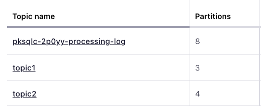

# Updating the number of partitions for a Kafka Topic

Imagine you want to change the partitions of your Kafka topic. You can use a streaming transformation to automatically stream all the messages from the original topic into a new Kafka topic that has the desired number of partitions or replicas.

## Setup

To accomplish this transformation, you'll create a stream based on the original topic:

```sql
 CREATE STREAM S1 (COLUMN0 VARCHAR KEY, COLUMN1 VARCHAR) WITH (KAFKA_TOPIC = 'topic1', VALUE_FORMAT = 'JSON');
```
Then you'll create a second stream that reads everything from the original topic and puts into a new topic with your desired number of 
partitions and replicas:

```sql
CREATE STREAM S2 WITH (KAFKA_TOPIC = 'topic2', VALUE_FORMAT = 'JSON', PARTITIONS = 2, REPLICAS = 2) AS SELECT * FROM S1;
```
Note that on Confluent Cloud handles settings such as `replicas` for you, so you can only specify replicas in an on-premise Kafka cluster.
## Running the example

<details>
  <summary>ksqlDB CLI </summary>

#### Prerequisites

* Docker running via [Docker Desktop](https://docs.docker.com/desktop/) or [Docker Engine](https://docs.docker.com/engine/install/)
* [Docker Compose](https://docs.docker.com/compose/install/). Ensure that the command `docker compose version` succeeds.

#### Run the commands

First, start ksqlDB and Kafka:

  ```shell
  docker compose -f ./docker/docker-compose-ksqldb-kraft-cluster.yml up -d
  ```

Then create the original Kafka topic:

```commandline
docker exec -it broker kafka-topics --bootstrap-server broker:29092 --topic topic1 --create --replication-factor 1 --partitions 1
```

Describe the topic:
```commandline
docker exec -t broker kafka-topics --bootstrap-server broker:29092 --topic topic1 --describe
```

The results should look something like this:
```commandline
Topic: topic1	TopicId: MtGWXVWVSM2aiFLL3Lvwug	PartitionCount: 1	ReplicationFactor: 1	Configs:
	Topic: topic1	Partition: 0	Leader: 1	Replicas: 1	Isr: 1
```

Now start a ksqlDB CLI session:
```commandline
docker exec -it ksqldb-cli ksql http://ksqldb-server:8088
```

Create a stream for the original topic:
```sql
CREATE STREAM S1 (COLUMN0 VARCHAR KEY, COLUMN1 VARCHAR) WITH (KAFKA_TOPIC = 'topic1', VALUE_FORMAT = 'JSON');
```

Now create another stream that will create the new topic with the desired number of partitions and replicas:

```sql
CREATE STREAM S2 WITH (KAFKA_TOPIC = 'topic2', VALUE_FORMAT = 'JSON', PARTITIONS = 2, REPLICAS = 2) AS SELECT * FROM S1;
```
Finally, describe the new topic:
```commandline
docker exec -t broker kafka-topics --bootstrap-server broker:9092 --topic topic2 --describe
```

Which should give you results resembling this:
```commandline
Topic: topic2	TopicId: FebuvQBIQHqNorJoWbkCkA	PartitionCount: 2	ReplicationFactor: 2	Configs: cleanup.policy=delete
	Topic: topic2	Partition: 0	Leader: 2	Replicas: 2,1	Isr: 2,1
	Topic: topic2	Partition: 1	Leader: 1	Replicas: 1,2	Isr: 1,2
```
Notice that the topic has 2 partitions, numbered 0 and 1, and 2 replicas on brokers with ids of 1 and 2.
</details>
<details>
<summary> Confluent Cloud </summary>

#### Prerequisites

* A [Confluent Cloud](https://confluent.cloud/signup) account
* A ksqlDB cluster created in Confluent Cloud. Follow [this quick start](https://docs.confluent.io/cloud/current/get-started/index.html#section-2-add-ksql-cloud-to-the-cluster) to create one.

#### Run the commands

In the Confluent Cloud Console, navigate to your environment and then click the `ksqlDB` link from left-side menu. Then click on the
name of ksqlDB cluster you created.

Create the topic `topic1` by selecting the `topics` link on the left.  Topics in Confluent Cloud have a default number of 6 partitions.  
But you can choose a custom number of partitions when you create the topic, so set it to 3.

Finally, run the following SQL statements in the ksqlDB UI `Editor` tab to create a stream based on the original topic:

```sql
CREATE STREAM S1 (COLUMN0 VARCHAR KEY, COLUMN1 VARCHAR) WITH (KAFKA_TOPIC = 'topic1', VALUE_FORMAT = 'JSON');
```

Then run another SQL statement that will select everything from the original topic into your new topic (created by the stream):
```sql
CREATE STREAM S2 WITH (KAFKA_TOPIC = 'topic2', VALUE_FORMAT = 'JSON', PARTITIONS = 4) AS SELECT * FROM S1;
```

View the results of your topics by clicking on the `topics` link on the left.  

The results should look something like this:




</details>

