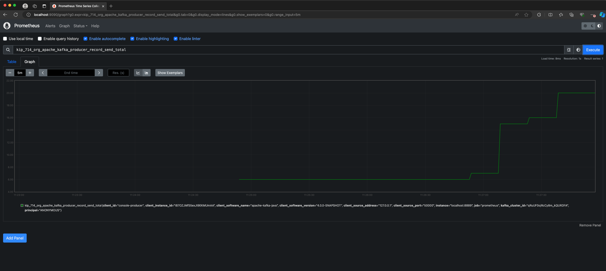

<!-- title: How to use KIP-714 for centralized monitoring of Kafka Clients -->
<!-- description: In this tutorial, learn how to use KIP-714 for centralized monitoring of Kafka Clients. -->

# How to use KIP-714 for centralized monitoring of Kafka Clients

Kafka's KIP-714 introduces a new capability that allows applications to send client metrics to the
broker for centralized monitoring. The broker can subsequently relay these metrics to a remote monitoring
system, facilitating the effective monitoring of Kafka client health and the identification of any problems.

The broker requires a Metrics Reporter plugin which implements the `ClientTelemetry` interface to
send client metrics to a remote monitoring system. This tutorial demonstrates how to use the plugin
to monitor Kafka clients.

This tutorial adds `ClientOtlpMetricsReporter` that aggregates [OpenTelemetry Protocol](https://opentelemetry.io/docs/specs/otel/protocol/) (OTLP) metrics
received from client, enhances them with additional client labels and forwards them via gRPC client
to an external OTLP receiver. The OTLP receiver can be any OpenTelemetry compatible backend like
Prometheus, Jaeger, Zipkin, etc. The plugin is implemented in Java and requires the jar to be
added to the Kafka broker libs.

The OTLP receiver for the tutorial is [otel-collector](https://opentelemetry.io/docs/collector/), which is a part of the OpenTelemetry project.
The `otel-collector` receives the metrics from the Kafka broker and forwards them to a Prometheus
instance for visualization.

## Prerequisites

- Java 17 or higher
- [Otel Collector](#otel-collector)
- [Prometheus](#prometheus)
- [Client Telemetry Reporter Plugin jar](#build-the-client-telemetry-reporter-plugin)
- [Apache Kafka Broker 3.7.0 or higher](#apache-kafka-broker)
- [Apache Kafka Client 3.7.0 or higher](#create-a-kafka-client)

### Otel Collector

Pull the otel-collector docker image:

```shell
docker pull otel/opentelemetry-collector-contrib
```

#### Configuration

Create a configuration file `config.yaml` for the otel-collector.

Example: Below configuration defines a pipeline that receives OTLP metrics from Kafka broker on `4317 gRPC port`
and forwards them to `Prometheus on 8889 port`. The configuration adds a namespace `kip-714` to the metrics
which can be used to identify the source of the metrics. The configuration also enables resource to telemetry
conversion to add labels to the metrics.

```yaml
receivers:
  otlp:
    protocols:
      grpc:
        endpoint: 0.0.0.0:4317

processors:
  batch:
    send_batch_max_size: 100
    send_batch_size: 10
    timeout: 10s

exporters:
  prometheus:
    endpoint: 0.0.0.0:8889
    namespace: kip-714
    resource_to_telemetry_conversion:
      enabled: true

service:
  pipelines:
    metrics:
      receivers: [otlp]
      processors: [batch]
      exporters: [prometheus]

```

#### Start the otel-collector

Replace `<local_path>` with the path to the `config.yaml` file.

```shell
docker run \
    -p 127.0.0.1:4317:4317 -p 8889:8889 -p 8888:8888 \
    -v <local_path>/config.yaml:/etc/otelcol-contrib/config.yaml \
    otel/opentelemetry-collector-contrib
 ```

### Prometheus

Download prometheus from [here](https://prometheus.io/download/).

#### Configuration

Update configuration file for prometheus `prometheus.yml` to scrape metrics from otel-collector.
```yaml
global:
  scrape_interval: 15s
  evaluation_interval: 15s

scrape_configs:
  - job_name: "prometheus"
    static_configs:
      - targets: ["localhost:8889"]
```

#### Start Prometheus

```shell
./prometheus --config.file=prometheus.yml
```

### Build the client-telemetry-reporter-plugin

Clone the `tutorials` repository and build the `client-telemetry-reporter-plugin` jar.

```shell
git clone git@github.com:confluentinc/tutorials.git
cd tutorials
./gradlew clean :client-telemetry-reporter-plugin:kafka:build
```

The above command builds the `client-telemetry-reporter-plugin` jar. The jar is located at:
```
client-telemetry-reporter-plugin/kafka/build/libs/client-telemetry-reporter-plugin.jar
```

### Apache Kafka Broker

Download the Apache Kafka 3.7.0 or higher release from [here](https://kafka.apache.org/downloads).

```shell
wget https://downloads.apache.org/kafka/3.8.0/kafka_2.13-3.8.0.tgz
tar -xvf kafka_2.13-3.8.0.tgz
cd kafka_2.13-3.8.0
```

#### Add the client-telemetry-reporter-plugin to the Kafka Broker

Copy the `client-telemetry-reporter-plugin.jar` to the Kafka broker libs directory.

```shell
cp <tutorials_repo_path>/tutorials/client-telemetry-reporter-plugin/kafka/build/libs/client-telemetry-reporter-plugin.jar <kafka_path>/kafka_2.13-3.8.0/libs/
```

#### Configure the Kafka Broker

Add the following configuration to the Kafka broker `kraft` properties file `server.properties`,
located at `<kafka_path>/kafka_2.13-3.8.0/config/kraft/server.properties`.

```properties
# Add the client telemetry reporter plugin
metric.reporters=io.confluent.developer.ClientOtlpMetricsReporter
```

#### Start the Kafka Broker

```shell
KAFKA_CLUSTER_ID="$(bin/kafka-storage.sh random-uuid)"
./bin/kafka-storage.sh format -t $KAFKA_CLUSTER_ID -c config/kraft/server.properties
OTEL_EXPORTER_OTLP_ENDPOINT=127.0.0.1:4317 ./bin/kafka-server-start.sh config/kraft/server.properties
```

#### Create metrics subscription

Create a metrics subscription to receive client metrics from the Kafka broker.

```shell
./bin/kafka-client-metrics.sh --bootstrap-server localhost:9092 --alter --name <subscription_name> --metrics <metric_name_prefix> --interval <interval_ms>
```

##### Examples:
The below command subscribes to all the metrics starting with (prefix match) `org.apache.kafka.producer.record`
with an interval of 10 seconds.

```shell
./bin/kafka-client-metrics.sh --bootstrap-server localhost:9092 --alter --name producer-record-metrics --metrics "org.apache.kafka.producer.record" --interval 10000
```

The below command subscribes to all the metrics with an interval of 10 seconds.

```shell
./bin/kafka-client-metrics.sh --bootstrap-server localhost:9092 --alter --name all-metrics --metrics "*" --interval 10000
```

### Create a Kafka Client

Create a Kafka client that sends metrics to the broker. The client should be using the Kafka client
version 3.7.0 or higher.

#### Start console producer

```shell
./bin/kafka-console-producer.sh --broker-list localhost:9092 --topic test
```

### Access Client Metrics

Produce messages to the topic `test` and observe the metrics in the Prometheus instance. Prometheus
can be accessed at `http://localhost:9090`.



Following log line indicates that the metrics are being sent by the plugin to the gRPC endpoint:

```shell
[grpc-default-executor-0] INFO io.confluent.developer.ClientOtlpMetricsReporter - Successfully exported metrics request to 127.0.0.1:4317
```