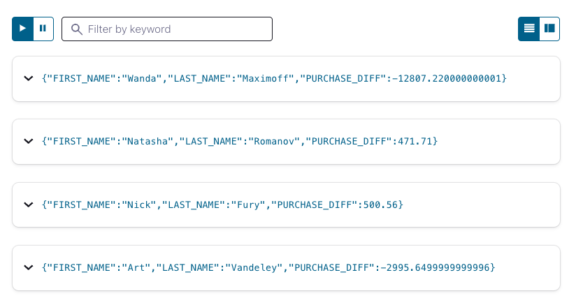

# Column difference

This tutorial demonstrates how to calculate the difference between two columns.

## Setup

The first thing we do is to create a stream named `PURCHASE_STREAM`

```sql
CREATE STREAM PURCHASE_STREAM (
                  ID VARCHAR,
                  PREVIOUS_PURCHASE DOUBLE,
                  CURRENT_PURCHASE DOUBLE,
                  TXN_TS VARCHAR,
                  FIRST_NAME VARCHAR,
                  LAST_NAME  VARCHAR)

 WITH (KAFKA_TOPIC='customer_purchases',
       VALUE_FORMAT='JSON',
       PARTITIONS=1);
```

## Calculate the difference between two columns

Now create a query to determine the difference between two columns:

```sql
CREATE STREAM PURCHASE_HISTORY_STREAM AS
  SELECT FIRST_NAME,
         LAST_NAME,
         CURRENT_PURCHASE - PREVIOUS_PURCHASE as PURCHASE_DIFF
FROM PURCHASE_STREAM;
```

## Running the example

<details>
  <summary>ksqlDB CLI </summary>

#### Prerequisites

* Docker running via [Docker Desktop](https://docs.docker.com/desktop/) or [Docker Engine](https://docs.docker.com/engine/install/)
* [Docker Compose](https://docs.docker.com/compose/install/). Ensure that the command `docker compose version` succeeds.

#### Run the commands

First, start ksqlDB and Kafka:

  ```shell
  docker compose -f ./docker/docker-compose-ksqldb.yml up -d
  ```
Next, open the ksqlDB CLI:

  ```shell
  docker exec -it ksqldb-cli ksql http://ksqldb-server:8088
  ```

Finally, run following SQL statements to create the `PURCHASE_STREAM` stream backed by Kafka running in Docker, populate it with
test data, and run the query that calculates the column difference.

```sql
 CREATE STREAM PURCHASE_STREAM (
                      ID VARCHAR,
                      PREVIOUS_PURCHASE DOUBLE,
                      CURRENT_PURCHASE DOUBLE,
                      TXN_TS VARCHAR,
                      FIRST_NAME VARCHAR,
                      LAST_NAME  VARCHAR)

 WITH (KAFKA_TOPIC='customer_purchases',
       VALUE_FORMAT='JSON',
       PARTITIONS=1);
```

Before we get too far, let’s set the `auto.offset.reset` configuration parameter to earliest. This means all new ksqlDB queries will
automatically compute their results from the beginning of a stream, rather than the end. This isn’t always what you’ll want to do in
production, but it makes query results much easier to see in examples like this.

`SET 'auto.offset.reset' = 'earliest';`

And let's adjust the column width, so we can easily see the results:

`SET CLI COLUMN-WIDTH 20`

```sql
INSERT INTO PURCHASE_STREAM (ID, PREVIOUS_PURCHASE, CURRENT_PURCHASE, TXN_TS, FIRST_NAME, LAST_NAME) VALUES ('1', 8000.54, 5004.89, '2020-12-04 02:35:43', 'Art', 'Vandeley');
INSERT INTO PURCHASE_STREAM (ID, PREVIOUS_PURCHASE, CURRENT_PURCHASE, TXN_TS, FIRST_NAME, LAST_NAME) VALUES ('2', 500.33, 1000.89, '2020-12-04 02:35:44', 'Nick', 'Fury');
INSERT INTO PURCHASE_STREAM (ID, PREVIOUS_PURCHASE, CURRENT_PURCHASE, TXN_TS, FIRST_NAME, LAST_NAME) VALUES ('3', 333.18, 804.89, '2020-12-04 02:35:45', 'Natasha', 'Romanov');
INSERT INTO PURCHASE_STREAM (ID, PREVIOUS_PURCHASE, CURRENT_PURCHASE, TXN_TS, FIRST_NAME, LAST_NAME) VALUES ('4', 72848.11, 60040.89, '2020-12-04 02:35:46', 'Wanda', 'Maximoff');
```

```sql
CREATE STREAM PURCHASE_HISTORY_STREAM AS
SELECT FIRST_NAME,
       LAST_NAME,
       CURRENT_PURCHASE - PREVIOUS_PURCHASE as PURCHASE_DIFF
FROM PURCHASE_STREAM;
```

```sql
 SELECT * from PURCHASE_HISTORY_STREAM;
```

The query output should look something like this:

```plaintext
+--------------------+--------------------+--------------------+
|FIRST_NAME          |LAST_NAME           |PURCHASE_DIFF       |
+--------------------+--------------------+--------------------+
|Art                 |Vandeley            |-2995.6499999999996 |
|Nick                |Fury                |500.56              |
|Natasha             |Romanov             |471.71              |
|Wanda               |Maximoff            |-12807.220000000001 |
```
When you are finished, clean up the containers used for this tutorial by running:

  ```shell
  docker compose -f ./docker/docker-compose-ksqldb.yml down -v
  ```
</details>
<details>
<summary> Confluent Cloud </summary>

#### Prerequisites

* A [Confluent Cloud](https://confluent.cloud/signup) account
* A ksqlDB cluster created in Confluent Cloud. Follow [this quick start](https://docs.confluent.io/cloud/current/get-started/index.html#section-2-add-ksql-cloud-to-the-cluster) to create one.

#### Run the commands

In the Confluent Cloud Console, navigate to your environment and then click the `ksqlDB` link from left-side menu. Then click on the
name of ksqlDB cluster you created.

Finally, run following SQL statements in the ksqlDB UI `Editor` tab to create the `PURCHASE_STREAM` stream, populate it with
test data, and run the column difference query.

```sql
CREATE STREAM PURCHASE_STREAM (
                      ID VARCHAR,
                      PREVIOUS_PURCHASE DOUBLE,
                      CURRENT_PURCHASE DOUBLE,
                      TXN_TS VARCHAR,
                      FIRST_NAME VARCHAR,
                      LAST_NAME  VARCHAR)

 WITH (KAFKA_TOPIC='customer_purchases',
       VALUE_FORMAT='JSON',
       PARTITIONS=1);
```


```sql
INSERT INTO PURCHASE_STREAM (ID, PREVIOUS_PURCHASE, CURRENT_PURCHASE, TXN_TS, FIRST_NAME, LAST_NAME) VALUES ('1', 8000.54, 5004.89, '2020-12-04 02:35:43', 'Art', 'Vandeley');
INSERT INTO PURCHASE_STREAM (ID, PREVIOUS_PURCHASE, CURRENT_PURCHASE, TXN_TS, FIRST_NAME, LAST_NAME) VALUES ('2', 500.33, 1000.89, '2020-12-04 02:35:44', 'Nick', 'Fury');
INSERT INTO PURCHASE_STREAM (ID, PREVIOUS_PURCHASE, CURRENT_PURCHASE, TXN_TS, FIRST_NAME, LAST_NAME) VALUES ('3', 333.18, 804.89, '2020-12-04 02:35:45', 'Natasha', 'Romanov');
INSERT INTO PURCHASE_STREAM (ID, PREVIOUS_PURCHASE, CURRENT_PURCHASE, TXN_TS, FIRST_NAME, LAST_NAME) VALUES ('4', 72848.11, 60040.89, '2020-12-04 02:35:46', 'Wanda', 'Maximoff');
```

```sql
CREATE STREAM PURCHASE_HISTORY_STREAM AS
SELECT FIRST_NAME,
       LAST_NAME,
       CURRENT_PURCHASE - PREVIOUS_PURCHASE as PURCHASE_DIFF
FROM PURCHASE_STREAM;
```

```sql
 SELECT * from PURCHASE_HISTORY_STREAM;
```

The query output should look like this:



</details>