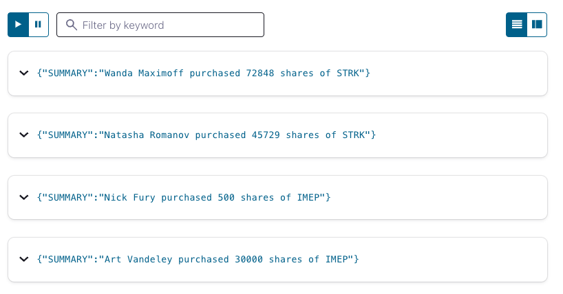

# Concatenation

In this tutorial, we'll show how to use the concatenation operator to create a single value from multiple columns.
       

## Setup

The first thing we do is create a stream named `ACTIVITY_STREAM` which simulates stock purchases and serves for our example of concatenating two columns together.

```sql
CREATE STREAM ACTIVITY_STREAM (
                  ID VARCHAR,
                  NUM_SHARES INT,
                  AMOUNT DOUBLE,
                  TXN_TS VARCHAR,
                  FIRST_NAME VARCHAR,
                  LAST_NAME  VARCHAR,
                  SYMBOL VARCHAR )

 WITH (KAFKA_TOPIC='stock_purchases',
       VALUE_FORMAT='JSON',
       PARTITIONS=1);
```
## Concatenating columns 

Now let's create a stream that concatenates several columns to create a summary of activity

```sql
CREATE STREAM SUMMARY_RESULTS AS
  SELECT FIRST_NAME + ' ' + LAST_NAME +
       ' purchased ' +
       CAST(NUM_SHARES AS VARCHAR) +
       ' shares of ' +
       SYMBOL AS SUMMARY
FROM ACTIVITY_STREAM;
```

## Running the example

<details>
  <summary>ksqlDB CLI </summary>

#### Prerequisites

* Docker running via [Docker Desktop](https://docs.docker.com/desktop/) or [Docker Engine](https://docs.docker.com/engine/install/)
* [Docker Compose](https://docs.docker.com/compose/install/). Ensure that the command `docker compose version` succeeds.

#### Run the commands

First, start ksqlDB and Kafka:

  ```shell
  docker compose -f ./docker/docker-compose-ksqldb.yml up -d
  ```
Next, open the ksqlDB CLI:

  ```shell
  docker exec -it ksqldb-cli ksql http://ksqldb-server:8088
  ```

Finally, run following SQL statements to create the `ACTIVITY_STREAM` stream backed by Kafka running in Docker, populate it with
test data, and run the query that concatenates several columns.

```sql
 CREATE STREAM ACTIVITY_STREAM (
                  ID VARCHAR,
                  NUM_SHARES INT,
                  AMOUNT DOUBLE,
                  TXN_TS VARCHAR,
                  FIRST_NAME VARCHAR,
                  LAST_NAME  VARCHAR,
                  SYMBOL VARCHAR )

 WITH (KAFKA_TOPIC='stock_purchases',
       VALUE_FORMAT='JSON',
       PARTITIONS=1);
```

Before we get too far, let’s set the `auto.offset.reset` configuration parameter to earliest. This means all new ksqlDB queries will
automatically compute their results from the beginning of a stream, rather than the end. This isn’t always what you’ll want to do in
production, but it makes query results much easier to see in examples like this.

`SET 'auto.offset.reset' = 'earliest';`

And let's adjust the column width, so we can easily see the results:

`SET CLI COLUMN-WIDTH 50`

```sql
INSERT INTO ACTIVITY_STREAM (id, num_shares, amount, txn_ts, first_name, last_name, symbol)
VALUES ('1', 30000, 5004.89, '2020-12-04 02:35:43', 'Art', 'Vandeley', 'IMEP');

INSERT INTO ACTIVITY_STREAM (id, num_shares, amount, txn_ts, first_name, last_name, symbol)
VALUES ('2', 500, 1000.89, '2020-12-04 02:35:44', 'Nick', 'Fury', 'IMEP');

INSERT INTO ACTIVITY_STREAM (id, num_shares, amount, txn_ts, first_name, last_name, symbol)
VALUES ('3', 45729, 804.89, '2020-12-04 02:35:45', 'Natasha', 'Romanov', 'STRK');

INSERT INTO ACTIVITY_STREAM (id, num_shares, amount, txn_ts, first_name, last_name, symbol)
VALUES ('4', 72848, 60040.89, '2020-12-04 02:35:46', 'Wanda', 'Maximoff', 'STRK');
```

```sql
CREATE STREAM SUMMARY_RESULTS AS
SELECT FIRST_NAME + ' ' + LAST_NAME +
       ' purchased ' +
       CAST(NUM_SHARES AS VARCHAR) +
       ' shares of ' +
       SYMBOL AS SUMMARY
FROM ACTIVITY_STREAM;
```

```sql
 SELECT * from SUMMARY_RESULTS;
```

The query output should look something like this:

```plaintext
+--------------------------------------------------+
|SUMMARY                                           |
+--------------------------------------------------+
|Art Vandeley purchased 30000 shares of IMEP       |
|Nick Fury purchased 500 shares of IMEP            |
|Natasha Romanov purchased 45729 shares of STRK    |
|Wanda Maximoff purchased 72848 shares of STRK     |
```

When you are finished, clean up the containers used for this tutorial by running:

  ```shell
  docker compose -f ./docker/docker-compose-ksqldb.yml down -v
  ```
</details>
<details>
<summary> Confluent Cloud </summary>

#### Prerequisites

* A [Confluent Cloud](https://confluent.cloud/signup) account
* A ksqlDB cluster created in Confluent Cloud. Follow [this quick start](https://docs.confluent.io/cloud/current/get-started/index.html#section-2-add-ksql-cloud-to-the-cluster) to create one.

#### Run the commands

In the Confluent Cloud Console, navigate to your environment and then click the `ksqlDB` link from left-side menu. Then click on the
name of ksqlDB cluster you created.

Finally, run following SQL statements in the ksqlDB UI `Editor` tab to create the `ACTIVITY_STREAM` stream, populate it with
test data, and run the column difference query.

```sql
CREATE STREAM ACTIVITY_STREAM (
                  ID VARCHAR,
                  NUM_SHARES INT,
                  AMOUNT DOUBLE,
                  TXN_TS VARCHAR,
                  FIRST_NAME VARCHAR,
                  LAST_NAME  VARCHAR,
                  SYMBOL VARCHAR )

 WITH (KAFKA_TOPIC='stock_purchases',
       VALUE_FORMAT='JSON',
       PARTITIONS=1);
```


```sql
INSERT INTO ACTIVITY_STREAM (id, num_shares, amount, txn_ts, first_name, last_name, symbol)
VALUES ('1', 30000, 5004.89, '2020-12-04 02:35:43', 'Art', 'Vandeley', 'IMEP');

INSERT INTO ACTIVITY_STREAM (id, num_shares, amount, txn_ts, first_name, last_name, symbol)
VALUES ('2', 500, 1000.89, '2020-12-04 02:35:44', 'Nick', 'Fury', 'IMEP');

INSERT INTO ACTIVITY_STREAM (id, num_shares, amount, txn_ts, first_name, last_name, symbol)
VALUES ('3', 45729, 804.89, '2020-12-04 02:35:45', 'Natasha', 'Romanov', 'STRK');

INSERT INTO ACTIVITY_STREAM (id, num_shares, amount, txn_ts, first_name, last_name, symbol)
VALUES ('4', 72848, 60040.89, '2020-12-04 02:35:46', 'Wanda', 'Maximoff', 'STRK');
```

```sql
CREATE STREAM SUMMARY_RESULTS AS
SELECT FIRST_NAME + ' ' + LAST_NAME +
       ' purchased ' +
       CAST(NUM_SHARES AS VARCHAR) +
       ' shares of ' +
       SYMBOL AS SUMMARY
FROM ACTIVITY_STREAM;
```

```sql
 SELECT * from SUMMARY_RESULTS;
```

The query output should look like this:



</details>
