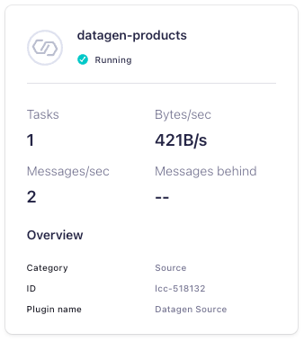
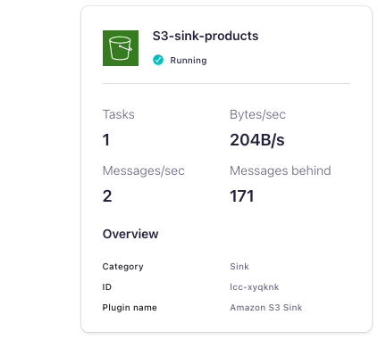

<!-- title: How to configure Confluent Cloud to connect to an AWS S3 bucket with PrivateLink -->
<!-- description: In this tutorial, learn how to configure Confluent Cloud to connect to an AWS S3 bucket with PrivateLink, with step-by-step instructions and supporting CLI commands. -->

# How to configure Confluent Cloud to connect to an AWS S3 bucket with PrivateLink

In this tutorial, you will set up an S3 Sink Connector in Confluent Cloud to sink topic data to a private S3 bucket. We will create an AWS egress access point in Confluent Cloud that the connector will use to connect to S3, create a private S3 bucket to stream data into, and configure the bucket to only allow connectivity from a Confluent Cloud egress access point. This tutorial is partner to the Confluent Cloud AWS egress access points documentation [here](https://docs.confluent.io/cloud/current/connectors/cc-s3-sink/cc-s3-sink-eap-aws.html).

## Prerequisites

* [Confluent CLI](https://docs.confluent.io/confluent-cli/current/install.html) installed
* [AWS CLI version 2](https://docs.aws.amazon.com/cli/latest/userguide/getting-started-install.html) installed
* A Confluent Cloud Dedicated Cluster set up with AWS PrivateLink networking. Refer to the documentation [here](https://docs.confluent.io/cloud/current/networking/private-links/aws-privatelink.html) to set up an AWS PrivateLink cluster, and ensure that you can successfully connect to your PrivateLink cluster from within your VPC by completing the validation steps [here](https://docs.confluent.io/cloud/current/networking/testing.html#test-private-link-tcp-connectivity-to-ccloud).

## Provision Datagen Source Connector

Before we can sink data into S3, we need some data! Let's use the [Datagen Source Connector](https://docs.confluent.io/cloud/current/connectors/cc-datagen-source.html) to populate a topic of product catalog updates.

* Login to the Confluent CLI:
```noformat
confluent login --prompt --save
```
* Find the environment ID of the form `env-123456` of the Confluent Cloud Environment in which your PrivateLink cluster resides:
```noformat
confluent environment list
```
* Set it as the active environment:
```noformat
confluent environment use <ENVIRONMENT_ID>
```
* Find the cluster ID of the form `lkc-123456` of your PrivateLink cluster:
```noformat
confluent kafka cluster list
```
* Set it to be the active cluster:
```noformat
confluent kafka cluster use <CLUSTER_ID>
```
* Create an API key / secret pair that the connector will use to authenticate to your Kafka cluster:
```noformat
confluent api-key create --resource <CLUSTER_ID>
```
* Create a JSON file `/tmp/datagen-connector.json`. Be sure to populate the key and secret from the previous step:
```json
{
    "name" : "datagen-products",
    "connector.class": "DatagenSource",
    "kafka.auth.mode": "KAFKA_API_KEY",
    "kafka.api.key": "<API_KEY>",
    "kafka.api.secret" : "<API_SECRET>",
    "kafka.topic" : "products",
    "output.data.format" : "AVRO",
    "quickstart" : "PRODUCT",
    "tasks.max" : "1"
}
```
* Provision the connector:
```noformat
confluent connect cluster create --config-file /tmp/datagen-connector.json
```
* After a minute or so, validate in the Confluent Cloud Console that the connector is running. In the lefhand navigation, select `Environments`, click into the environment, then click the PrivateLink cluster. In the lefthand navigation, select `Connectors` and verify that the connector state is `Running` and generating messages:



## Create AWS egress access point

Follow [these steps](https://docs.confluent.io/cloud/current/connectors/cc-s3-sink/cc-s3-sink-eap-aws.html) to create an AWS egress access point. Once the access point is `Ready`, note the `Endpoint ID` and the `VPC endpoint DNS name`. We will use these in our S3 bucket policy and in the S3 Sink Connector configuration.

## Create private S3 bucket

Create a private S3 bucket in the same AWS region where your cluster is running. Note that the region must be specified both in the `--region` argument and as a location constraint. You can pick any bucket name; here we use `products-private` in the `us-east-2` AWS region:

```noformat
aws s3api create-bucket \
    --bucket products-private \
    --region us-east-2 \
    --acl private \
    --create-bucket-configuration LocationConstraint=us-east-2
```

Next, create the following bucket policy in a file `/tmp/policy.json`. Be sure to specify your bucket name in the `Resource` array, and the VPC endpoint ID that was generated when you provisioned the egress access point in Confluent Cloud:

```json
{
    "Version": "2012-10-17",
    "Id": "Policy1415115909152",
    "Statement": [
        {
            "Sid": "Access-to-specific-VPCE-only",
            "Effect": "Deny",
            "Principal": "*",
            "Action": "s3:*",
            "Resource": [
                "arn:aws:s3:::products-private",
                "arn:aws:s3:::products-private/*"
            ],
            "Condition": {
                "StringNotEquals": {
                    "aws:SourceVpce": "vpce-01234567890123456"
                }
            }
        }
    ]
}
```

Now, use the AWS CLI to apply the policy to your bucket:

```noformat
aws s3api put-bucket-policy --bucket products-private --policy file:///tmp/policy.json
```

# Generate AWS credentials

Create an AWS access key and secret for use in the S3 Sink Connector configuration by following the instructions [here](https://docs.aws.amazon.com/IAM/latest/UserGuide/id_credentials_access-keys.html).

## Provision S3 Sink Connector

Create a JSON file `/tmp/s3-connector.json`. Be sure to populate values specific to your setup:
* Specify the Confluent Cloud cluster API key and secret that you provisioned earlier as the values for `kafka.api.key` and `kafka.api.secret`, respectively.
* Specify the AWS access key ID and secret access key as the values for `aws.access.key.id` and `aws.secret.access.key`, respectively.
* Update the `s3.bucket.name` if using a different bucket name.
* Update the `store.url` using the `VPC endpoint DNS name` generated when you create the egress access point in Confluent Cloud. The URL should be `https://bucket.` followed by the VPC endpoint DNS name starting from `vpce-01234567890123456-...-`. 
```json
{
  "config": {
    "topics": "products",
    "schema.context.name": "default",
    "input.data.format": "AVRO",
    "connector.class": "S3_SINK",
    "name": "S3-sink-products",
    "kafka.auth.mode": "KAFKA_API_KEY",
    "kafka.api.key": "<API_KEY>>",
    "kafka.api.secret": "<API_SECRET>",
    "aws.access.key.id": "<AWS_ACCESS_KEY_ID>",
    "aws.secret.access.key": "<AWS_SECRET_ACCESS_KEY>",
    "s3.bucket.name": "products-private",
    "store.url": "https://bucket.vpce-01234567890123456-01234567.s3.us-east-2.vpce.amazonaws.com",
    "s3.part.size": "5242880",
    "s3.wan.mode": "false",
    "output.data.format": "JSON",
    "json.decimal.format": "BASE64",
    "topics.dir": "topics",
    "path.format": "'year'=YYYY/'month'=MM/'day'=dd/'hour'=HH",
    "time.interval": "HOURLY",
    "rotate.schedule.interval.ms": "-1",
    "flush.size": "1000",
    "behavior.on.null.values": "ignore",
    "timezone": "UTC",
    "subject.name.strategy": "TopicNameStrategy",
    "tombstone.encoded.partition": "tombstone",
    "locale": "en",
    "s3.schema.partition.affix.type": "NONE",
    "schema.compatibility": "NONE",
    "store.kafka.keys": "false",
    "value.converter.connect.meta.data": "true",
    "store.kafka.headers": "false",
    "s3.object.tagging": "false",
    "max.poll.interval.ms": "300000",
    "max.poll.records": "500",
    "tasks.max": "1"
  }
}
```

## Validate connector

To validate that the connector is sinking data into S3, navigate to the Connectors page in the Confluent Cloud Console. Check that the connector state is `Running` and processing messages:

.

It may take some time for data to show up since the connector sinks on an hourly basis. You can also check in S3 to make sure that data is showing up in the bucket that you created above.

## Clean up

Once you have finished, clean up any resources created for this tutorial that you no longer need:

* the `datagen-products` and `S3-sink-products` connectors, and corresponding connector configurations in the `/tmp/` directory.
* the AWS egress access point
* the PrivateLink Confluent Cloud cluster
* the S3 bucket