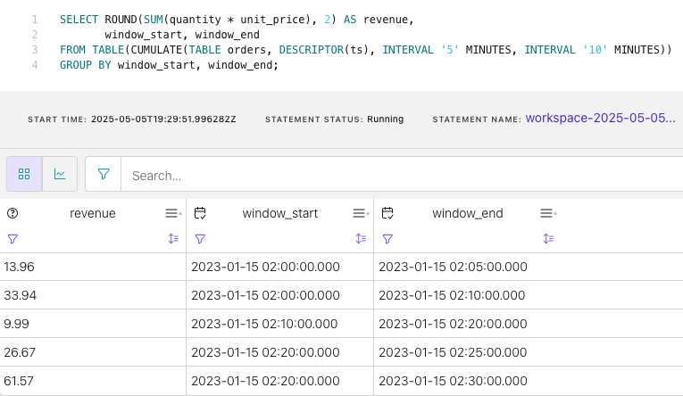

# How to create cumulating windows in Flink SQL

Suppose you have time series events in a Kafka topic and wish to simultaneously group them into fixed-size tumbling 
windows in addition to splitting each tumbling window into several windows having the same window start but having 
window ends that vary by a fixed step size. Flink SQL's _cumulating windows_ do exactly that. For example, let's say you
want to build an hourly revenue dashboard that also outputs revenue at the half hour mark so that you can simultaneously
look at the hourly trend alongside any trends within the hour (e.g., does revenue peak earlier in the hour or later?).
In this tutorial, we'll use Flink SQL cumulating windows to aggregate revenue from a table of orders and output total 
revenue for 10-minute widows in addition to revenue 5 minutes into the window.

## Setup

Because windowed aggregations are calculated on a base table, let's assume the following DDL for our base `orders` table:

```sql
CREATE TABLE orders (
    order_id INT,
    item_id INT,
    quantity INT,
    unit_price DOUBLE,
    ts TIMESTAMP(3),
    -- declare ts as event time attribute and use strictly ascending timestamp watermark strategy
    WATERMARK FOR ts AS ts
)
```

The timestamp is an important attribute since we’ll be summing revenue over time. Also, because we are going to 
aggregate over time windows, we must define a watermark strategy. In this case, we use strictly ascending timestamps, 
i.e., any row with a timestamp that is less than or equal to the latest observed event timestamp is considered late and 
ignored.

## Compute windowed aggregation

Given the `orders` table definition above, the following transient query sums revenue (`quantity * unit_price`) over
cumulating windows. It uses a windowing table-valued function (TVF) to compute the revenue for 10-minute windows that 
also "fire early" every 5 minutes. It also captures the window start and end times.

```sql
SELECT ROUND(SUM(quantity * unit_price), 2) AS revenue,
    window_start,
    window_end
FROM TABLE(CUMULATE(TABLE orders, DESCRIPTOR(ts), INTERVAL '5' MINUTES, INTERVAL '10' MINUTES))
GROUP BY window_start, window_end;
```

## Running the example

You can run the example backing this tutorial in one of three ways: a Flink Table API-based JUnit test, locally with the Flink SQL Client 
against Flink and Kafka running in Docker, or with Confluent Cloud.

<details>
  <summary>Flink Table API-based test</summary>

  #### Prerequisites

  * Java 11, e.g., follow the OpenJDK installation instructions [here](https://openjdk.org/install/) if you don't have Java. 
  * Docker running via [Docker Desktop](https://docs.docker.com/desktop/) or [Docker Engine](https://docs.docker.com/engine/install/)

  #### Run the test

Run the following command to execute [FlinkSqlCumulatingWindowTest#testCumulatingWindows](src/test/java/io/confluent/developer/FlinkSqlCumulatingWindowTest.java):

  ```plaintext
  ./gradlew test
  ```

  The test starts Kafka and Schema Registry with [Testcontainers](https://testcontainers.com/), runs the Flink SQL commands
  above against a local Flink `StreamExecutionEnvironment`, and ensures that cumulating window query results are what we expect.
</details>

<details>
  <summary>Flink SQL Client CLI</summary>

  #### Prerequisites

  * Docker running via [Docker Desktop](https://docs.docker.com/desktop/) or [Docker Engine](https://docs.docker.com/engine/install/)
  * [Docker Compose](https://docs.docker.com/compose/install/). Ensure that the command `docker compose version` succeeds.

  #### Run the commands

  First, start Flink and Kafka:

  ```shell
  docker compose -f ./docker/docker-compose-flinksql.yml up -d
  ```

  Next, open the Flink SQL Client CLI:

  ```shell
  docker exec -it flink-sql-client sql-client.sh
  ```

  Finally, run following SQL statements to create the `orders` table backed by Kafka running in Docker, populate it with
  test data, and run the cumulating windows query.

  ```sql
  CREATE TABLE orders (
      order_id INT,
      item_id INT,
      quantity INT,
      unit_price DOUBLE,
      ts TIMESTAMP(3),
      -- declare ts as event time attribute and use strictly ascending timestamp watermark strategy
      WATERMARK FOR ts AS ts
  ) WITH (
      'connector' = 'kafka',
      'topic' = 'orders',
      'properties.bootstrap.servers' = 'broker:9092',
      'scan.startup.mode' = 'earliest-offset',
      'key.format' = 'raw',
      'key.fields' = 'order_id',
      'value.format' = 'avro-confluent',
      'value.avro-confluent.url' = 'http://schema-registry:8081',
      'value.fields-include' = 'ALL'
  );

  ```

  ```sql
  INSERT INTO orders VALUES
      (0, 100, 2, 6.98, TO_TIMESTAMP('2023-01-15 02:02:30')),
      (1, 102, 2, 9.99, TO_TIMESTAMP('2023-01-15 02:08:00')),
      (2, 102, 1, 9.99, TO_TIMESTAMP('2023-01-15 02:19:30')),
      (3, 203, 1, 8.10, TO_TIMESTAMP('2023-01-15 02:22:30')),
      (4, 192, 3, 6.19, TO_TIMESTAMP('2023-01-15 02:23:20')),
      (5, 100, 3, 6.98, TO_TIMESTAMP('2023-01-15 02:25:30')),
      (6, 100, 2, 6.98, TO_TIMESTAMP('2023-01-15 02:25:49')),
      (7, 632, 4, 8.00, TO_TIMESTAMP('2023-01-15 02:34:30'));
  ```

  ```sql
  SELECT ROUND(SUM(quantity * unit_price), 2) AS revenue,
      window_start,
      window_end
  FROM TABLE(CUMULATE(TABLE orders, DESCRIPTOR(ts), INTERVAL '5' MINUTES, INTERVAL '10' MINUTES))
  GROUP BY window_start, window_end;
  ```

  The query output should look like this:

  ```plaintext
                        revenue            window_start              window_end
                          13.96 2023-01-15 02:00:00.000 2023-01-15 02:05:00.000
                          33.94 2023-01-15 02:00:00.000 2023-01-15 02:10:00.000
                           9.99 2023-01-15 02:10:00.000 2023-01-15 02:20:00.000
                          26.67 2023-01-15 02:20:00.000 2023-01-15 02:25:00.000
                          61.57 2023-01-15 02:20:00.000 2023-01-15 02:30:00.000
  ```

  When you are finished, clean up the containers used for this tutorial by running:

  ```shell
  docker compose -f ./docker/docker-compose-flinksql.yml down
  ```

</details>

<details>
  <summary>Confluent Cloud</summary>

  #### Prerequisites

  * A [Confluent Cloud](https://confluent.cloud/signup) account
  * A Flink compute pool created in Confluent Cloud. Follow [this](https://docs.confluent.io/cloud/current/flink/get-started/quick-start-cloud-console.html) quick start to create one.

  #### Run the commands

  In the Confluent Cloud Console, navigate to your environment and then click the `Open SQL Workspace` button for the compute
  pool that you have created.

  Select the default catalog (Confluent Cloud environment) and database (Kafka cluster) to use with the dropdowns at the top right.

  Finally, run following SQL statements to create the `orders` table, populate it with test data, and run the cumulating windows query.

  ```sql
  CREATE TABLE orders (
      order_id INT,
      item_id INT,
      quantity INT,
      unit_price DOUBLE,
      ts TIMESTAMP(3),
      -- declare ts as event time attribute and use strictly ascending timestamp watermark strategy
      WATERMARK FOR ts AS ts
  );
  ```

  ```sql
  INSERT INTO orders VALUES
      (0, 100, 2, 6.98, TO_TIMESTAMP('2023-01-15 02:02:30')),
      (1, 102, 2, 9.99, TO_TIMESTAMP('2023-01-15 02:08:00')),
      (2, 102, 1, 9.99, TO_TIMESTAMP('2023-01-15 02:19:30')),
      (3, 203, 1, 8.10, TO_TIMESTAMP('2023-01-15 02:22:30')),
      (4, 192, 3, 6.19, TO_TIMESTAMP('2023-01-15 02:23:20')),
      (5, 100, 3, 6.98, TO_TIMESTAMP('2023-01-15 02:25:30')),
      (6, 100, 2, 6.98, TO_TIMESTAMP('2023-01-15 02:25:49')),
      (7, 632, 4, 8.00, TO_TIMESTAMP('2023-01-15 02:34:30'));
  ```

  ```sql
  SELECT ROUND(SUM(quantity * unit_price), 2) AS revenue,
         window_end
  FROM TABLE(CUMULATE(TABLE orders, DESCRIPTOR(ts), INTERVAL '5' MINUTES, INTERVAL '10' MINUTES))
  GROUP BY window_end;
  ```

  The query output should look like this:

  
