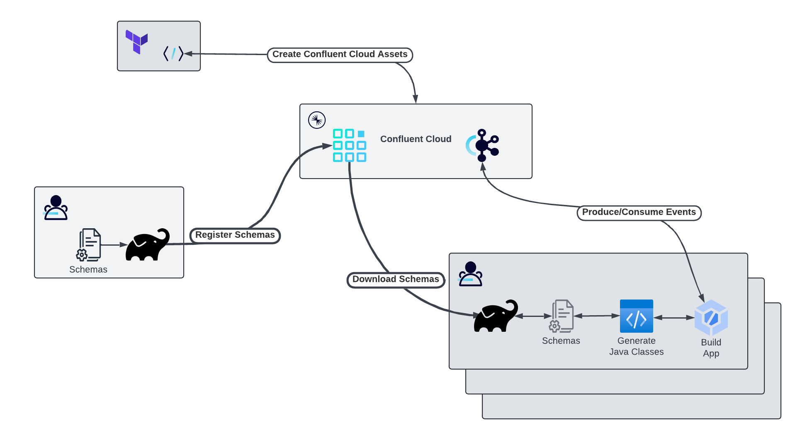

# Managing Data Contracts

Data contracts consist not only of the schemas to define the structure of events, but also rulesets allowing for more fine-grained validations,
controls, and discovery. In this tutorial, we'll evolve a schemas and add data quality and migration rules.



In the workflow above, we see these tools in action:
* The [Confluent Terraform Provider](https://registry.terraform.io/providers/confluentinc/confluent/latest/docs) is used to define Confluent Cloud assets (Kafka cluster(s), Data Governance, Kafka Topics, and Schema Configurations).
* Using the newly created Schema Registry, data engineers and architects define the schema of the events that comprise the organization's canonical data model - i.e. entities, events, and commands that are shared across applications. - along with other parts of the data contract. This includes data quality rules, metadata, and migration rules. A gradle plugin is utilized to register the schemas and related elements of the data contract with the Schema Registry.
* Applications which producer and/or consume these event types can download the schemas from the Schema Registry. In our example, this is a JVM application built using Gradle. A gradle plugin is used to download the schemas, after which another gradle plugin is used to generate Java classes from those schemas - thus providing the application with compile-time type safety.

We will cover these steps in detail.

## Running the Example

In this tutorial we'll create Confluent Cloud infrastructure - including a Kafka cluster and Schema Registry. Then we'll create
a Kafka topic named `membership-avro` to store `Membership` events. The Apache Avro schema is maintained and managed in this repo
along with metadata and migration rules. 

We will evolve the `membership` schema, refactoring the events to encapsulate the date-related fields of version 1 into its
own `record` type in version 2. Typically this would be a breaking change. However, [data migration rules](https://docs.confluent.io/cloud/current/sr/fundamentals/data-contracts.html#migration-rules) in the schema registry
allow us to perform this schema change without breaking producers or consumers.

At the time this is written, this data contract functionality is available to Java, GO, and .NET Confluent client implementations. We'll update this example as other clients evolve.

### Prerequisites

Clone the `confluentinc/tutorials` GitHub repository (if you haven't already) and navigate to the `tutorials` directory:

```shell
git clone git@github.com:confluentinc/tutorials.git
cd tutorials
```

Here are the tools needed to run this tutorial:
* [Confluent Cloud](http://confluent.cloud)
* [Confluent CLI](https://docs.confluent.io/confluent-cli/current/install.html)
* [Terraform](https://developer.hashicorp.com/terraform/install?product_intent=terraform)
* [jq](https://jqlang.github.io/jq/)
* JDK 17
* IDE of choice

> [!Note] When installing and configuring the Confluent CLI, include the Confluent Cloud credentials as environment variables for future use. For instance with bash or zsh, include these export statements:
> 
> ```shell
> export CONFLUENT_CLOUD_API_KEY=<API KEY>
> export CONFLUENT_CLOUD_API_SECRET<API SECRET>
> ```
> 

### Executing Terraform

To create Confluent Cloud assets, change to the `cc-terraform` subdirectory. We'll step through the commands and what they do.

#### Create Confluent Cloud Assets

Terraform can use the value of any environment variable whose name begins with `TF_VAR_` as the value of a terraform variable of the same name. For more on this functionality, see the [terraform documentation](https://developer.hashicorp.com/terraform/cli/config/environment-variables#tf_var_name).

Our example requires we set the value the `org_id` variable from Confluent Cloud. This denotes which organization will house the Confluent Cloud assets we are creating. So let's export the Confluent Cloud organization ID to a terraform environment variable.

This command may open a browser window asking you to authenticate to Confluent Cloud. Once that's complete, the result of
`confluent organization list` is queried by `jq` to extract the `id` of the current organization to which you are authenticated:

```shell
export TF_VAR_org_id=$(confluent organization list -o json | jq -c -r '.[] | select(.is_current)' | jq '.id')
```

Now, we are ready to initialize the terraform environment, create a `plan` and `apply` said plan to create CC assets:

```shell
terraform init
terraform plan -out "tfplan"
terraform apply "tfplan"
```

Let's have a look at what we've created. We now have a Confluent Cloud environment, which includes a Kafka cluster and Data Governance platform with Confluent Schema Registry. Within the Kafka cluster, we create a Kafka topic named `membership-avro`.

```terraform
resource "confluent_kafka_topic" "membership_avro" {
  topic_name = "membership-avro"
  kafka_cluster {
    id = confluent_kafka_cluster.kafka_cluster.id
  }
  rest_endpoint = confluent_kafka_cluster.kafka_cluster.rest_endpoint
...
  partitions_count = 10
...
}
```

Then we configure the subject containing the value of events for this topic using `confluent_subject_config`. This tells the Schema Registry that `membership-avro-value` schemas will be `BACKWARD` compatible and defines an attribute called `major_version` to be used as the `compatibilityGroup`.

```terraform
resource "confluent_subject_config" "membership_value_avro" {
  subject_name = "${confluent_kafka_topic.membership_avro.topic_name}-value"

  schema_registry_cluster {
    id = data.confluent_schema_registry_cluster.advanced.id
  }
  rest_endpoint = data.confluent_schema_registry_cluster.advanced.rest_endpoint
...
  compatibility_level = "BACKWARD"
  compatibility_group = "major_version"
...  
}
```

For more on these data contract configuration enhancements, refer to the CC docs on [data contracts](https://docs.confluent.io/cloud/current/sr/fundamentals/data-contracts.html#configuration-enhancements). 


#### Prepare Client Properties

This demo has tailored the output of `terraform apply` to return the properties needed to connect to Confluent Cloud. The command below will 
reformat the names of those properties into the names used in Kafka Client configurations, then export those outputs to a properties file 
in our project:

```shell
terraform output -json \
 | jq -r 'to_entries | map( {key: .key|tostring|split("_")|join("."), value: .value} ) | map("\(.key)=\(.value.value)") | .[]' \
 | while read -r line ; do echo "$line"; done > ../shared/src/main/resources/confluent.properties
```

All Kafka Client code in this project loads connection properties form `shared/src/main/resources/confluent.properties`. For an example of this 
properties file, see [confluent.properties.orig](shared/src/main/resources/confluent.properties.orig).

> [!NOTE]
> The file-based approach we're using here is NOT recommended for a production-quality application. Perhaps a secrets manager implementation would be better suited - which the major cloud providers all offer, or perhaps a tool like Hashicorp Vault. Such a tool would also have client libraries in a Maven repository for the JVM applications to access the secrets.

### Producing and Consuming Events

We'll create producer and consumer classes to configure and provide Kafka clients for our application(s). In the `shared` module there are implementations to encapsulate this behavior:

```kotlin
abstract class BaseProducer<Key, Value>(propOverrides: Map<String, Any> = mapOf<String, Any>()) {
    ...
    val kafkaProducer: KafkaProducer<Key, Value> = KafkaProducer(getProducerProperties(propOverrides))

    open fun send(topicName: String, key: Key, value: Value): Future<RecordMetadata?>? {
        ...
    }
}

abstract class BaseConsumer<Key, Value>(propOverrides: Map<String, Any> = mapOf<String, Any>()) {
    ...
    val kafkaConsumer: KafkaConsumer<Key, Value> = KafkaConsumer(getConsumerProperties(propOverrides))

    fun start(topics: List<String>) {
        kafkaConsumer.subscribe(topics)
        while (true) {
            val records = kafkaConsumer.poll(Duration.ofSeconds(5))
            for (record in records) {
                logger.trace("Record from ${record.topic()}, ${record.partition()}, ${record.offset()}")
                consumeRecord(record.key(), record.value())
            }
        }
    }

    abstract fun consumeRecord(key: Key, value: Value)
}
```

Build the `shared` module from the root of the `tutorials` repo:
```shell
./gradlew :data-contracts:shared:build
```

As the schemas evolve, we'll create implementations of these base classes to produce and consume events with specific versions of the schemas.

### Schema Evolution

Schemas are CODE! As such, they will evolve to meet new business requirements. In the upcoming sections, we'll create JVM applications - written in Kotlin and built with Gradle - using different versions of the schema. We will utilize the Data Governance migration rules, allowing us to make what would ordinarily be "breaking changes" to the schema version but with the caveat of a mapping between the versions based on Kafka client configurations.

#### Working with Version 1

The `membership` schema begins as a fairly "flat" data model, where the fields to denote start and end dates are at the top-level of the object:

```avroschema
{
  "name": "Membership",
  "namespace": "io.confluent.devrel",
  "type": "record",
  "fields": [
    {"name": "user_id", "type": "string"},
    {"name": "start_date", "type": {"type": "int", "logicalType": "date"}},
    {"name": "end_date", "type": {"type": "int", "logicalType": "date"}}
  ]
}
```

Using the [schema-registry-plugin](https://github.com/ImFlog/schema-registry-plugin) for gradle, we can register this schema with the Confluent Schema Registry.

```kotlin
schemaRegistry {
    ...
    register {
        subject(inputSubject =  "membership-avro-value", type = "AVRO", file = "$avroSchemaDir/membership_v1.avsc")
            .setMetadata("$metadataDir/membership_major_version_1.json")
    }
}    
```

Remember the `compatibility_group` parameter from the subject configuration? This now comes into play as we set the metadata on the schema to denote this version as `major_version=1`:

```json
{
  "properties": {
    "major_version": 1
  }
}
```

Schema registration is completed via the `registerSchemas` task of the `schemas` module:

```shell
./gradlew :data-contracts:schemas:registerSchemasTask
```

To use this schema in an application - `app-schema-v1` - we utilize the same gradle plugin's `downloadSchemasTask`. First we define the subjects we want to download. In this example, we copy the schema to directory `src/main/avro`:

```kotlin
schemaRegistry {
    download {
        // download the membership avro schema, version 1
        subject("membership-avro-value", "${projectDir}/src/main/avro", 1)
    }
}
```

With the schema(s) downloaded, we next want to generate Java code to provide our application an SDK with compile-time bindings to serialize and deserialize events to and from the `membership-avro` topic. Let's use the [gradle-avro-dependency-plugin](https://github.com/bakdata/gradle-avro-dependency-plugin) to generate code, using the `generateAvroJava` task.

For simplicity, I have encapsulated `downloadSchemasTask` with the `generateAvroJava` task into a custom gradle task named `generateCode`, executed as follows:

```shell
./gradlew :data-contracts:app-schema-v1:generateCode
```

Now implement classes to produce and consume events with this schema. First the producer class, extending `BaseProducer`:

```kotlin
class MembershipProducer: BaseProducer<String, Membership>(mapOf(
    ProducerConfig.KEY_SERIALIZER_CLASS_CONFIG to "org.apache.kafka.common.serialization.StringSerializer",
    ProducerConfig.VALUE_SERIALIZER_CLASS_CONFIG to "io.confluent.kafka.serializers.KafkaAvroSerializer",
    ProducerConfig.CLIENT_ID_CONFIG to "membership-producer-app-v1",
    AbstractKafkaSchemaSerDeConfig.LATEST_COMPATIBILITY_STRICT to true,
    AbstractKafkaSchemaSerDeConfig.USE_LATEST_VERSION to false,
    AbstractKafkaSchemaSerDeConfig.USE_LATEST_WITH_METADATA to "major_version=1"
))
```

This implementation must pass the configuration parameters required to serialize the key and value of events to the `membership-avro` topic. In this use case, the key is a `String` and the value is of type `Membership` - generated from the schema. The value uses the schema-registry-aware `Serializer` implementation `KafkaAvroSerializer`. The underlying serializer is also configured to NOT use the latest version of the schema (`use.latest.version`) and to relax the strict compatibility checks (`latest.compatibility.strict`). For more on these settings, see the CC doc's explanation of [the differences between preregistered and client-derived schemas](https://docs.confluent.io/platform/current/schema-registry/fundamentals/serdes-develop/index.html#handling-differences-between-preregistered-and-client-derived-schemas).

Let's also implement the `BaseConsumer` class, configured to use this `major_version` of the schema:

```kotlin
class MembershipConsumer: BaseConsumer<String, Membership>(mapOf(
    ConsumerConfig.GROUP_ID_CONFIG to "app-schema-v1",
    ConsumerConfig.AUTO_OFFSET_RESET_CONFIG to "earliest",
    ConsumerConfig.KEY_DESERIALIZER_CLASS_CONFIG to "org.apache.kafka.common.serialization.StringDeserializer",
    ConsumerConfig.VALUE_DESERIALIZER_CLASS_CONFIG to "io.confluent.kafka.serializers.KafkaAvroDeserializer",
    AbstractKafkaSchemaSerDeConfig.LATEST_COMPATIBILITY_STRICT to true,
    AbstractKafkaSchemaSerDeConfig.USE_LATEST_VERSION to false,
    AbstractKafkaSchemaSerDeConfig.USE_LATEST_WITH_METADATA to "major_version=1"
)) {

    override fun consumeRecord(
        key: String,
        value: Membership
    ) {
        logger.info("Received Membership ${key}, ${value}")
    }
}
```

The `consumeRecord` function is where we would typically start the business logic of actually "consuming" Kafka events. This implementation simply logs the consumed records to the provided `Logger` instance in the superclass.

To exercise these producer and consumer implementations, we created a `main` function in the `ApplicationMain` class to start a consumer instance and a producer instance periodically send random events to the `membership-avro` topic.

<details>
    <summary>Main function</summary>

```kotlin
@JvmStatic
fun main(args: Array<String>) {
    runBlocking {
        println("Starting application main...")
        println(args.joinToString(" "))
        
        val messageInterval = 1.toDuration(DurationUnit.SECONDS)
        val sendDuration = 100.toDuration(DurationUnit.SECONDS)

        val producer = MembershipProducer()
        val consumer = MembershipConsumer()

        // start a thread with a consumer instance
        thread {
            consumer.start(listOf("membership-avro"))
        }

        // every 1 second for the next  100 seconds, send a randomly-generated event to the kafka topic
        coroutineScope {
            launch {
                val until = Clock.System.now().plus(sendDuration)
                while(Clock.System.now().compareTo(until) < 0) {
                    val userId = UUID.randomUUID().toString()
                    val membership = Membership.newBuilder()
                        .setUserId(userId)
                        .setStartDate(LocalDate.now().minusDays(Random.nextLong(100, 1000)))
                        .setEndDate(LocalDate.now().plusWeeks(Random.nextLong(1, 52)))
                        .build()
                    producer.send("membership-avro", userId, membership)
                    delay(messageInterval.inWholeSeconds)
                }
            }
        }
        producer.close()
    }
}
```

</details>

Running this application will print the events being consumed from Kafka:

<details>
    <summary>Console Output</summary>

```shell
[Thread-0] INFO io.confluent.devrel.datacontracts.shared.BaseConsumer - Received Membership 8e65d8e2-4ad8-475f-8f74-d724865ddbd8, {"user_id": "8e65d8e2-4ad8-475f-8f74-d724865ddbd8", "start_date": "2022-06-13", "end_date": "2025-03-25"}
[Thread-0] INFO io.confluent.devrel.datacontracts.shared.BaseConsumer - Received Membership 22781e70-8d2c-4d02-b325-9cdc8663ed19, {"user_id": "22781e70-8d2c-4d02-b325-9cdc8663ed19", "start_date": "2022-06-10", "end_date": "2025-11-11"}
[Thread-0] INFO io.confluent.devrel.datacontracts.shared.BaseConsumer - Received Membership 06ec5d95-d38c-4bac-9693-a01596eeedd7, {"user_id": "06ec5d95-d38c-4bac-9693-a01596eeedd7", "start_date": "2024-03-25", "end_date": "2025-02-25"}
[Thread-0] INFO io.confluent.devrel.datacontracts.shared.BaseConsumer - Received Membership 881bf838-1fe1-423e-9afc-0742e3080b5b, {"user_id": "881bf838-1fe1-423e-9afc-0742e3080b5b", "start_date": "2022-07-25", "end_date": "2025-07-08"}
[Thread-0] INFO io.confluent.devrel.datacontracts.shared.BaseConsumer - Received Membership 73254321-72f9-4783-949f-652f5ca9542e, {"user_id": "73254321-72f9-4783-949f-652f5ca9542e", "start_date": "2022-05-11", "end_date": "2025-03-11"}
```

</details>

#### Evolving to Version 2

The decision is made to refactor the `membership` schema to encapsulate the date fields into a type - `ValidityPeriod` - which can be reused in other event types.

```avroschema
{
    "type": "record",
    "name": "ValidityPeriod",
    "fields": [
      {"name": "from", "type": {"type": "int", "logicalType": "date"}},
      {"name": "to", "type": {"type": "int", "logicalType": "date"}
      }
    ]
}
```

The refactored `membership` schema now references this new type:

```avroschema
{
  "name": "Membership",
  "namespace": "io.confluent.devrel",
  "type": "record",
  "fields": [
    { "name": "user_id", "type": "string" },
    { "name": "validity_period", "type": "io.confluent.devrel.ValidityPeriod" }
  ]
}
```

When we register version 2 of the `membership-avro-value` subject, use `addLocalReference` to include the `validityPeriod` type:

```kotlin
schemaRegistry{
    register {
        subject(inputSubject =  "membership-avro-value", type = "AVRO", file = "$avroSchemaDir/membership_v1.avsc")
            .setMetadata("$metadataDir/membership_major_version_1.json")

        subject(inputSubject =  "membership-avro-value", type = "AVRO", file = "$avroSchemaDir/membership_v2.avsc")
            .addLocalReference("validity-period", "$avroSchemaDir/validity_period.avsc")
            .setMetadata("$metadataDir/membership_major_version_2.json")
            .setRuleSet("$rulesetDir/membership_migration_rules.json")
    }
}
```

Register the new schema using our gradle plugin:

```shell
./gradlew :data-contracts:schemas:registerSchemasTask
```

Download the schema to the version 2 application and generate the Java classes for this schema:

```shell
./gradlew :data-contracts:app-schema-v2:generateCode
```

In the `app-schema-v2` module, we'll find a new implementation of a `MembershipConsumer`:

```kotlin
class MembershipConsumer: BaseConsumer<String, Membership>(mapOf(
    ConsumerConfig.GROUP_ID_CONFIG to "app-schema-v2",
    ConsumerConfig.AUTO_OFFSET_RESET_CONFIG to "earliest",
    ConsumerConfig.KEY_DESERIALIZER_CLASS_CONFIG to "org.apache.kafka.common.serialization.StringDeserializer",
    ConsumerConfig.VALUE_DESERIALIZER_CLASS_CONFIG to "io.confluent.kafka.serializers.KafkaAvroDeserializer",
    AbstractKafkaSchemaSerDeConfig.LATEST_COMPATIBILITY_STRICT to true,
    AbstractKafkaSchemaSerDeConfig.USE_LATEST_WITH_METADATA to "major_version=2"
)
) {
    override fun consumeRecord(key: String, value: Membership) {
        logger.info("v2 - Received Membership ${key}, ${value}")
    }
}
```

A closer look at the configuration of this consumer shows we are now using `latest.compatibility.strict` and specifying `major_version=2`
in the `use.latest.with.metadata` configuration for the deserializer.

Running the `main` function in `ApplicationV2Main` will consume the events from the `membership-avro` topic, but with a noticeable difference from the `app-schama-v1` application:

<details>
    <summary>Console output version 2</summary>

```shell
[Thread-0] INFO io.confluent.devrel.datacontracts.shared.BaseConsumer - v2 - Received Membership af39d3a4-53b3-4d27-9bf0-3528965b6149, {"user_id": "af39d3a4-53b3-4d27-9bf0-3528965b6149", "validity_period": {"from": "2022-10-29", "to": "2025-08-28"}}
[Thread-0] INFO io.confluent.devrel.datacontracts.shared.BaseConsumer - v2 - Received Membership 4baddf48-6dda-40c0-8c4d-57222932c0b8, {"user_id": "4baddf48-6dda-40c0-8c4d-57222932c0b8", "validity_period": {"from": "2024-07-13", "to": "2025-08-14"}}
[Thread-0] INFO io.confluent.devrel.datacontracts.shared.BaseConsumer - v2 - Received Membership 6c385e77-4e50-4784-bf35-2e0be4aca6a6, {"user_id": "6c385e77-4e50-4784-bf35-2e0be4aca6a6", "validity_period": {"from": "2023-10-17", "to": "2025-03-13"}}
[Thread-0] INFO io.confluent.devrel.datacontracts.shared.BaseConsumer - v2 - Received Membership 79d36f24-4317-4f88-acb2-8f48ff88991b, {"user_id": "79d36f24-4317-4f88-acb2-8f48ff88991b", "validity_period": {"from": "2022-09-13", "to": "2025-09-25"}}
[Thread-0] INFO io.confluent.devrel.datacontracts.shared.BaseConsumer - v2 - Received Membership 2167c361-2202-41ce-b48e-35967b3fb8c7, {"user_id": "2167c361-2202-41ce-b48e-35967b3fb8c7", "validity_period": {"from": "2023-05-01", "to": "2025-05-01"}}
```

</details>

We're consuming the same events, but the deserialized with version 2 of the schema.

## Teardown


When you're done with the tutorial, issue this command from the `cc-terraform` directory to destroy the Confluent Cloud environment
we created:

```shell
terraform destroy -auto-approve
```

Check the Confluent Cloud console to ensure this environment no longer exists.


