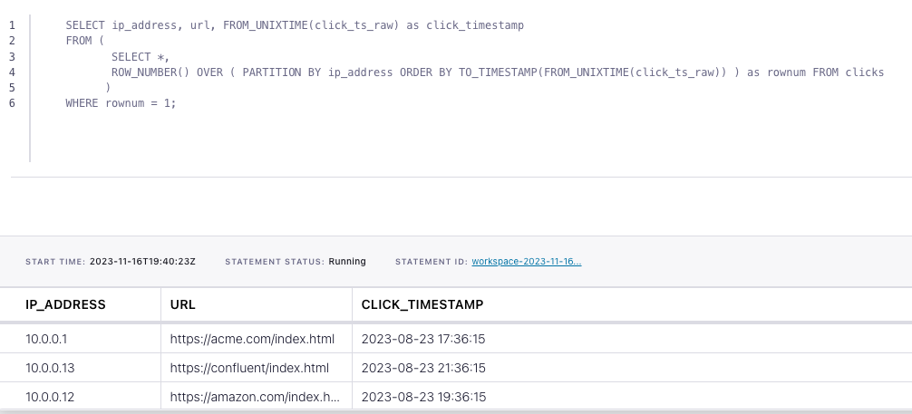

# How to filter duplicate events from a Kafka topic with Flink SQL

Consider a topic with events that represent clicks on a website. Each event contains an IP address, a URL, and a timestamp.
In this tutorial, we'll leverage Flink SQL to deduplicate these click events.

## Setup

Let's assume the following DDL for our base `clicks` table:

```sql
CREATE TABLE clicks (
    ip_address VARCHAR,
    url VARCHAR,
    click_ts_raw BIGINT
);
```

## Deduplicate events

Given the `clicks` table definition above, we can deduplicate with the following query:

```sql
SELECT ip_address, url, FROM_UNIXTIME(click_ts_raw) as click_timestamp
FROM (
       SELECT *,
       ROW_NUMBER() OVER ( PARTITION BY ip_address ORDER BY TO_TIMESTAMP(FROM_UNIXTIME(click_ts_raw)) ) as rownum FROM clicks
      )
WHERE rownum = 1;
```

Let's look at this from the inside subquery out. The subquery orders events by time and assigns a unique number per IP address to each row. This process makes it possible to eliminate duplicate records where the row number is greater than one. Let’s discuss the critical parts of the subquery:

1. `ROW_NUMBER()` starting at one, this assigns a unique, sequential number to each row
2. `PARTITION BY` specifies how to partition the data for deduplication. This should be the column(s) which will only have one row per value after deduplication. In our case here it’s the key of the table, `ip_address`
3. `ORDER BY` orders by the provided column and it’s required to be a time attribute. The time attribute column can be processing time (system time of the machine running the Flink job) or event time. By default `ORDER BY` puts rows in ascending (`ASC`) order. By using `ASC` order you’ll keep the first row. Should you want to keep the last row you should use `ORDER BY <time_attribute> DESC`


## Running the example

You can run the example backing this tutorial in one of three ways: a Flink Table API-based JUnit test, locally with the Flink SQL Client 
against Flink and Kafka running in Docker, or with Confluent Cloud.

<details>
  <summary>Flink Table API-based test</summary>

  #### Prerequisites

  * Java 17, e.g., follow the OpenJDK installation instructions [here](https://openjdk.org/install/) if you don't have Java. 
  * Docker running via [Docker Desktop](https://docs.docker.com/desktop/) or [Docker Engine](https://docs.docker.com/engine/install/)

  #### Run the test

Run the following command to execute [FlinkSqlFindingDistinctTest#testFindDistinct](src/test/java/io/confluent/developer/FlinkSqlFindingDistinctTest.java):

  ```plaintext
  ./gradlew clean :deduplication:flinksql:test
  ```

  The test starts Kafka and Schema Registry with [Testcontainers](https://testcontainers.com/), runs the Flink SQL commands
  above against a local Flink `StreamExecutionEnvironment`, and ensures that the deduplicated results are what we expect.
</details>

<details>
  <summary>Flink SQL Client CLI</summary>

  #### Prerequisites

  * Docker running via [Docker Desktop](https://docs.docker.com/desktop/) or [Docker Engine](https://docs.docker.com/engine/install/)
  * [Docker Compose](https://docs.docker.com/compose/install/). Ensure that the command `docker compose version` succeeds.

  #### Run the commands

  First, start Flink and Kafka:

  ```shell
  docker compose -f ./docker/docker-compose-flinksql.yml up -d
  ```

  Next, open the Flink SQL Client CLI:

  ```shell
  docker exec -it flink-sql-client sql-client.sh
  ```

  Finally, run following SQL statements to create the `clicks` table backed by Kafka running in Docker, populate it with
  test data, and run the deduplication query.

  ```sql
  CREATE TABLE clicks (
      ip_address VARCHAR, 
      url VARCHAR,
      click_ts_raw BIGINT
  ) WITH (
      'connector' = 'kafka',
      'topic' = 'clicks',
      'properties.bootstrap.servers' = 'broker:9092',
      'scan.startup.mode' = 'earliest-offset',
      'key.format' = 'raw',
      'key.fields' = 'ip_address',
      'value.format' = 'avro-confluent',
      'value.avro-confluent.url' = 'http://schema-registry:8081',
      'value.fields-include' = 'EXCEPT_KEY'
  );
  ```

  ```sql
  INSERT INTO clicks
  VALUES ( '10.0.0.1',  'https://acme.com/index.html',    1692812175),
         ( '10.0.0.12', 'https://amazon.com/index.html',  1692826575),
         ( '10.0.0.13', 'https://confluent/index.html',   1692826575),
         ( '10.0.0.1',  'https://acme.com/index.html',    1692812175),
         ( '10.0.0.12', 'https://amazon.com/index.html',  1692819375),
         ( '10.0.0.13', 'https://confluent/index.html',   1692826575);
  ```

  ```sql
  SELECT ip_address, url, FROM_UNIXTIME(click_ts_raw) as click_timestamp
  FROM (
         SELECT *,
         ROW_NUMBER() OVER ( PARTITION BY ip_address ORDER BY TO_TIMESTAMP(FROM_UNIXTIME(click_ts_raw)) ) as rownum FROM clicks
        )
  WHERE rownum = 1;
  ```

  The query output should look like this:

  ```plaintext
                     ip_address                            url                click_timestamp
                       10.0.0.1    https://acme.com/index.html            2023-08-23 17:36:15
                      10.0.0.13   https://confluent/index.html            2023-08-23 21:36:15
                      10.0.0.12  https://amazon.com/index.html            2023-08-23 19:36:15
  ```

  When you are finished, clean up the containers used for this tutorial by running:

  ```shell
  docker compose -f ./docker/docker-compose-flinksql.yml down
  ```

</details>

<details>
  <summary>Confluent Cloud</summary>

  #### Prerequisites

  * A [Confluent Cloud](https://confluent.cloud/signup) account
  * A Flink compute pool created in Confluent Cloud. Follow [this](https://docs.confluent.io/cloud/current/flink/get-started/quick-start-cloud-console.html) quick start to create one.

  #### Run the commands

  In the Confluent Cloud Console, navigate to your environment and then click the `Open SQL Workspace` button for the compute
  pool that you have created.

  Select the default catalog (Confluent Cloud environment) and database (Kafka cluster) to use with the dropdowns at the top right.

  Finally, run following SQL statements to create the `clicks` table, populate it with test data, and run the deduplication query.

  ```sql
  CREATE TABLE clicks (
      ip_address VARCHAR,
      url VARCHAR,
      click_ts_raw BIGINT
  );
  ```

  ```sql
  INSERT INTO clicks
  VALUES ( '10.0.0.1',  'https://acme.com/index.html',    1692812175),
         ( '10.0.0.12', 'https://amazon.com/index.html',  1692826575),
         ( '10.0.0.13', 'https://confluent/index.html',   1692826575),
         ( '10.0.0.1',  'https://acme.com/index.html',    1692812175),
         ( '10.0.0.12', 'https://amazon.com/index.html',  1692819375),
         ( '10.0.0.13', 'https://confluent/index.html',   1692826575);
  ```

  ```sql
  SELECT ip_address, url, FROM_UNIXTIME(click_ts_raw) as click_timestamp
  FROM (
         SELECT *,
         ROW_NUMBER() OVER ( PARTITION BY ip_address ORDER BY TO_TIMESTAMP(FROM_UNIXTIME(click_ts_raw)) ) as rownum FROM clicks
        )
  WHERE rownum = 1;
  ```

  The query output should look like this:

  
