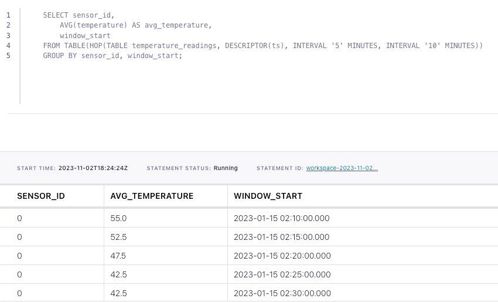

# How to create hopping windows in Flink SQL

Suppose you have time series events in a Kafka topic and wish to calculate statistics on the events grouped into 
fixed-size, possibly overlapping, contiguous time intervals called *hopping windows*. For example, let's say you have a topic
with events that represent a stream of temperature readings over time. In this tutorial, we'll use Flink SQL hopping
windows to detect when the temperature from a sensor drops below 45 degrees Fahrenheit for a period of 10 minutes.

## Setup

Because windowed aggregations are calculated on a base table, let's assume the following DDL for our base `temperature_readings` table:

```sql
CREATE TABLE temperature_readings (
    sensor_id INT,
    temperature DOUBLE,
    ts TIMESTAMP(3),
    -- declare ts as event time attribute and use strictly ascending timestamp watermark strategy
    WATERMARK FOR ts AS ts
);
```

The timestamp is an important attribute since we’ll be modeling the average sensor temperature over time.
Also, because we are going to aggregate over time windows, we must define a watermark strategy. In this case, we use 
strictly ascending timestamps, i.e., any row with a timestamp that is less than or equal to the latest observed event 
timestamp is considered late and ignored.

## Compute windowed aggregation

Given the `temperature_readings` table definition above, we can figure out the average temperature per sensor over hopping
10-minute windows using a windowing table-valued function (TVF).

```sql
SELECT sensor_id,
       AVG(temperature) AS avg_temperature,
       window_start,
       window_end
FROM TABLE(HOP(TABLE temperature_readings, DESCRIPTOR(ts), INTERVAL '5' MINUTES, INTERVAL '10' MINUTES))
GROUP BY sensor_id, window_start, window_end;
```

## Running the example

You can run the example backing this tutorial in one of three ways: a Flink Table API-based JUnit test, locally with the Flink SQL Client 
against Flink and Kafka running in Docker, or with Confluent Cloud.

<details>
  <summary>Flink Table API-based test</summary>

  #### Prerequisites

  * Java 11, e.g., follow the OpenJDK installation instructions [here](https://openjdk.org/install/) if you don't have Java. 
  * Docker running via [Docker Desktop](https://docs.docker.com/desktop/) or [Docker Engine](https://docs.docker.com/engine/install/)

  #### Run the test

Run the following command to execute [FlinkSqlHoppingWindowTest#testHoppingWindows](src/test/java/io/confluent/developer/FlinkSqlHoppingWindowTest.java):

  ```plaintext
  ./gradlew test
  ```

  The test starts Kafka and Schema Registry with [Testcontainers](https://testcontainers.com/), runs the Flink SQL commands
  above against a local Flink `StreamExecutionEnvironment`, and ensures that hopping window query results are what we expect.
</details>

<details>
  <summary>Flink SQL Client CLI</summary>

  #### Prerequisites

  * Docker running via [Docker Desktop](https://docs.docker.com/desktop/) or [Docker Engine](https://docs.docker.com/engine/install/)
  * [Docker Compose](https://docs.docker.com/compose/install/). Ensure that the command `docker compose version` succeeds.

  #### Run the commands

  First, start Flink and Kafka:

  ```shell
  docker compose -f ./docker/docker-compose-flinksql.yml up -d
  ```

  Next, open the Flink SQL Client CLI:

  ```shell
  docker exec -it flink-sql-client sql-client.sh
  ```

  Finally, run following SQL statements to create the `temperature_readings` table backed by Kafka running in Docker, populate it with
  test data, and run the hopping windows query.

  ```sql
  CREATE TABLE temperature_readings (
      sensor_id INT,
      temperature DOUBLE,
      ts TIMESTAMP(3),
      -- declare ts as event time attribute and use strictly ascending timestamp watermark strategy
      WATERMARK FOR ts AS ts
  ) WITH (
      'connector' = 'kafka',
      'topic' = 'temperature-readings',
      'properties.bootstrap.servers' = 'broker:9092',
      'scan.startup.mode' = 'earliest-offset',
      'key.format' = 'raw',
      'key.fields' = 'sensor_id',
      'value.format' = 'avro-confluent',
      'value.avro-confluent.url' = 'http://schema-registry:8081',
      'value.fields-include' = 'EXCEPT_KEY'
  );
  ```

  ```sql
  INSERT INTO temperature_readings VALUES
      (0, 55, TO_TIMESTAMP('2023-01-15 02:15:30')),
      (0, 50, TO_TIMESTAMP('2023-01-15 02:20:30')),
      (0, 45, TO_TIMESTAMP('2023-01-15 02:25:30')),
      (0, 40, TO_TIMESTAMP('2023-01-15 02:30:30')),
      (0, 45, TO_TIMESTAMP('2023-01-15 02:35:30')),
      (0, 50, TO_TIMESTAMP('2023-01-15 02:40:30')),
      (0, 55, TO_TIMESTAMP('2023-01-15 02:45:30')),
      (0, 60, TO_TIMESTAMP('2023-01-15 02:50:30'));
  ```

  ```sql
  SELECT sensor_id,
      AVG(temperature) AS avg_temperature,
      window_start,
      window_end
  FROM TABLE(HOP(TABLE temperature_readings, DESCRIPTOR(ts), INTERVAL '5' MINUTES, INTERVAL '10' MINUTES))
  GROUP BY sensor_id, window_start, window_end;
  ```

  The query output should look like this:

  ```plaintext
     sensor_id                avg_temperature            window_start              window_end
             0                           55.0 2023-01-15 02:10:00.000 2023-01-15 02:20:00.000
             0                           52.5 2023-01-15 02:15:00.000 2023-01-15 02:25:00.000
             0                           47.5 2023-01-15 02:20:00.000 2023-01-15 02:30:00.000
             0                           42.5 2023-01-15 02:25:00.000 2023-01-15 02:35:00.000
             0                           42.5 2023-01-15 02:30:00.000 2023-01-15 02:40:00.000
             0                           47.5 2023-01-15 02:35:00.000 2023-01-15 02:45:00.000
             0                           52.5 2023-01-15 02:40:00.000 2023-01-15 02:50:00.000
  ```

  When you are finished, clean up the containers used for this tutorial by running:

  ```shell
  docker compose -f ./docker/docker-compose-flinksql.yml down
  ```

</details>

<details>
  <summary>Confluent Cloud</summary>

  #### Prerequisites

  * A [Confluent Cloud](https://confluent.cloud/signup) account
  * A Flink compute pool created in Confluent Cloud. Follow [this](https://docs.confluent.io/cloud/current/flink/get-started/quick-start-cloud-console.html) quick start to create one.

  #### Run the commands

  In the Confluent Cloud Console, navigate to your environment and then click the `Open SQL Workspace` button for the compute
  pool that you have created.

  Select the default catalog (Confluent Cloud environment) and database (Kafka cluster) to use with the dropdowns at the top right.

  Finally, run following SQL statements to create the `temperature_readings` table, populate it with test data, and run the hopping windows query.

  ```sql
  CREATE TABLE temperature_readings (
      sensor_id INT,
      temperature DOUBLE,
      ts TIMESTAMP(3),
      -- declare ts as event time attribute and use strictly ascending timestamp watermark strategy
      WATERMARK FOR ts AS ts
  );
  ```

  ```sql
  INSERT INTO temperature_readings VALUES
      (0, 55, TO_TIMESTAMP('2023-01-15 02:15:30')),
      (0, 50, TO_TIMESTAMP('2023-01-15 02:20:30')),
      (0, 45, TO_TIMESTAMP('2023-01-15 02:25:30')),
      (0, 40, TO_TIMESTAMP('2023-01-15 02:30:30')),
      (0, 45, TO_TIMESTAMP('2023-01-15 02:35:30')),
      (0, 50, TO_TIMESTAMP('2023-01-15 02:40:30')),
      (0, 55, TO_TIMESTAMP('2023-01-15 02:45:30')),
      (0, 60, TO_TIMESTAMP('2023-01-15 02:50:30'));
  ```

  ```sql
  SELECT sensor_id,
      AVG(temperature) AS avg_temperature,
      window_start
  FROM TABLE(HOP(TABLE temperature_readings, DESCRIPTOR(ts), INTERVAL '5' MINUTES, INTERVAL '10' MINUTES))
  GROUP BY sensor_id, window_start;
  ```

  The query output should look like this:

  
