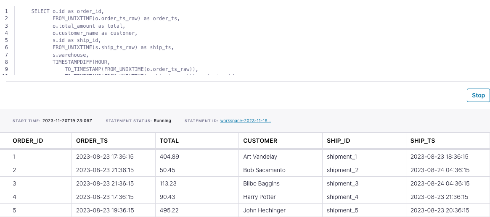

<!-- title: How to join two streams of data with Flink SQL -->
<!-- description: In this tutorial, learn how to join two streams of data with Flink SQL, with step-by-step instructions and supporting code. -->

# How to join two streams of data with Flink SQL

Suppose you have two streams containing events for orders and shipments. In this tutorial, we'll use Flink SQL to join
these two streams to create a new, enriched one. The new stream will tell us which orders have been successfully shipped,
how long it took for them to ship, and the warehouse from which they shipped.

## Setup

Let's assume the following DDL for our base `orders` and `shipments` tables:

```sql
CREATE TABLE orders (
    id INT,
    total_amount DOUBLE,
    customer_name VARCHAR,
    order_ts_raw BIGINT
);
```

```sql
CREATE TABLE shipments (
    id VARCHAR,
    order_id INT,
    warehouse VARCHAR,
    ship_ts_raw BIGINT
);
```

Note that we are using `order_ts_raw` and `ship_ts_raw` as records timestamp in these tables. This is going to be important later on when we write queries that need to know about the time each event occurred at. By using a field of the event, we can process the events at any time and get a deterministic result. This is known as _event time_.

## Join event streams

Given the `orders` and `shipments` table definitions above, let’s join these event streams together to gain some insight
into the order-to-shipping process. Then we’ll discuss some of the concepts used in the query to enable retrieving your
desired results.

```sql
SELECT o.id as order_id,
       FROM_UNIXTIME(o.order_ts_raw) as ORDER_TS,
       o.total_amount as TOTAL,
       o.customer_name as CUSTOMER,
       s.id as SHIP_ID,
       FROM_UNIXTIME(s.ship_ts_raw) as SHIP_TS,
       s.warehouse,
       TIMESTAMPDIFF(HOUR,
           TO_TIMESTAMP(FROM_UNIXTIME(o.order_ts_raw)),
           TO_TIMESTAMP(FROM_UNIXTIME(s.ship_ts_raw))) as HR_TO_SHIP
FROM orders o
INNER JOIN shipments s
    ON o.id = s.order_id
        AND TO_TIMESTAMP(FROM_UNIXTIME(s.ship_ts_raw))
            BETWEEN TO_TIMESTAMP(FROM_UNIXTIME(o.order_ts_raw))
            AND TO_TIMESTAMP(FROM_UNIXTIME(o.order_ts_raw))  + INTERVAL '7' DAY;

```

Earlier we talked about the event timestamps stored as a BIGINT type which is great for flexibity, but hard to read and
interpret. So to address that issue we used the `FROM_UNIXTIME` function for both the order and
shipment timestamp. `FROM_UNIXTIME` converts a numeric type (an epoch based timestamp in this case) to a formatted string
in the default format of `yyyy-MM-dd HH:mm:ss`, which is now an easily understood format.

We also used additional temporal functions, `TO_TIMESTAMP`, `TIMESTAMPDIFF`, and `INTERVAL`.  `TO_TIMESTAMP` converts a date
string, like the one returned from `TO_TIMESTAMP` into a timestamp suitable for other functions such as `TIMESTAMPDIFF` and
`INTERVAL`. We used `TIMESTAMPDIFF` to calculate the difference, in hours, between accepting the order and shipping
to the customer.

The query we issued performs an inner join between the orders and shipments. This kind of join only emits events when
there’s a match on the criteria of both sides of the join. In effect, this only joins orders that have successfully
shipped. Additionally, we used the `INTERVAL` function to perform an interval join, which also needs a SQL timestamp to
specify an addition join requirement that order and shipment occurred within seven days of each other.

## Running the example

You can run the example backing this tutorial in one of three ways: a Flink Table API-based JUnit test, locally with the Flink SQL Client 
against Flink and Kafka running in Docker, or with Confluent Cloud.

<details>
  <summary>Flink Table API-based test</summary>

  #### Prerequisites

  * Java 17, e.g., follow the OpenJDK installation instructions [here](https://openjdk.org/install/) if you don't have Java. 
  * Docker running via [Docker Desktop](https://docs.docker.com/desktop/) or [Docker Engine](https://docs.docker.com/engine/install/)

  #### Run the test

Run the following command to execute [FlinkSqlIntervalJoinTest#testJoin](src/test/java/io/confluent/developer/FlinkSqlIntervalJoinTest.java):

  ```plaintext
  ./gradlew clean :joining-stream-stream:flinksql:test
  ```

  The test starts Kafka and Schema Registry with [Testcontainers](https://testcontainers.com/), runs the Flink SQL commands
  above against a local Flink `StreamExecutionEnvironment`, and ensures that the join results are what we expect.
</details>

<details>
  <summary>Flink SQL Client CLI</summary>

  #### Prerequisites

  * Docker running via [Docker Desktop](https://docs.docker.com/desktop/) or [Docker Engine](https://docs.docker.com/engine/install/)
  * [Docker Compose](https://docs.docker.com/compose/install/). Ensure that the command `docker compose version` succeeds.

  #### Run the commands

  First, start Flink and Kafka:

  ```shell
  docker compose -f ./docker/docker-compose-flinksql.yml up -d
  ```

  Next, open the Flink SQL Client CLI:

  ```shell
  docker exec -it flink-sql-client sql-client.sh
  ```

  Finally, run following SQL statements to create the `orders` and `shipments` tables backed by Kafka running in Docker, populate them with
  test data, and run the join query.

  ```sql
  CREATE TABLE orders (
      id INT,
      total_amount DOUBLE,
      customer_name VARCHAR,
      order_ts_raw BIGINT
  ) WITH (
      'connector' = 'kafka',
      'topic' = 'orders',
      'properties.bootstrap.servers' = 'broker:9092',
      'scan.startup.mode' = 'earliest-offset',
      'key.format' = 'raw',
      'key.fields' = 'id',
      'value.format' = 'avro-confluent',
      'value.avro-confluent.url' = 'http://schema-registry:8081',
      'value.fields-include' = 'EXCEPT_KEY'
  );
  ```

  ```sql
  CREATE TABLE shipments (
      id VARCHAR,
      order_id INT,
      warehouse VARCHAR,
      ship_ts_raw BIGINT
  ) WITH (
      'connector' = 'kafka',
      'topic' = 'shipments',
      'properties.bootstrap.servers' = 'broker:9092',
      'scan.startup.mode' = 'earliest-offset',
      'key.format' = 'raw',
      'key.fields' = 'id',
      'value.format' = 'avro-confluent',
      'value.avro-confluent.url' = 'http://schema-registry:8081',
      'value.fields-include' = 'EXCEPT_KEY'
  );
  ```

  ```sql
  INSERT INTO orders
  VALUES ( 1, 404.89, 'Art Vandelay',    1692812175),
         ( 2,  50.45, 'Bob Sacamanto',   1692826575),
         ( 3, 113.23, 'Bilbo Baggins',   1692826575),
         ( 4,  90.43, 'Harry Potter',    1692812175),
         ( 5, 495.22, 'John Hechinger',  1692819375),
         ( 6, 410.13, 'Mandelorean',     1692826575),
         ( 7, 333.84, 'Jane Smith',      1692822975),
         ( 8,  26.14, 'HJ Pennypacker' , 1692819375),
         ( 9, 450.77, 'Colonel Mustard', 1692812175),
         ( 10,195.13, 'Prof. Jones',     1692822975);
  ```

  ```sql
  INSERT INTO shipments
  VALUES ('shipment_1',   1, 'Bar Harbor',     1692815775),
         ('shipment_2',   2, 'Boston',         1692851775),
         ('shipment_3',   3, 'Providence',     1692851775),
         ('shipment_4',   4, 'Springfield',    1692826575),
         ('shipment_5',   5, 'Bar Harbor',     1692822975),
         ('shipment_6',   6, 'Boston',         1692851775),
         ('shipment_7',   7, 'Jackson Hole',   1692840975),
         ('shipment_8',   8, 'Whitefish'   ,   1692822975),
         ('shipment_9',   9, 'Jackson Hole',   1692984975),
         ('shipment_10', 10, 'Columbia Falls', 1692984975);
  ```

  ```sql
  SELECT o.id as order_id,
         FROM_UNIXTIME(o.order_ts_raw) as order_ts,
         o.total_amount as total,
         o.customer_name as customer,
         s.id as ship_id,
         FROM_UNIXTIME(s.ship_ts_raw) as ship_ts,
         s.warehouse,
         TIMESTAMPDIFF(HOUR,
             TO_TIMESTAMP(FROM_UNIXTIME(o.order_ts_raw)),
             TO_TIMESTAMP(FROM_UNIXTIME(s.ship_ts_raw))) as hr_to_ship
  FROM orders o
  INNER JOIN shipments s
      ON o.id = s.order_id
          AND TO_TIMESTAMP(FROM_UNIXTIME(s.ship_ts_raw))
              BETWEEN TO_TIMESTAMP(FROM_UNIXTIME(o.order_ts_raw))
              AND TO_TIMESTAMP(FROM_UNIXTIME(o.order_ts_raw))  + INTERVAL '7' DAY;
  ```

  The query output should look like this:

  ```plaintext
    order_id                       order_ts                          total                       customer                        ship_id                        ship_ts                      warehouse  hr_to_ship
           1            2023-08-23 17:36:15                         404.89                   Art Vandelay                     shipment_1            2023-08-23 18:36:15                     Bar Harbor           1
           2            2023-08-23 21:36:15                          50.45                  Bob Sacamanto                     shipment_2            2023-08-24 04:36:15                         Boston           7
           3            2023-08-23 21:36:15                         113.23                  Bilbo Baggins                     shipment_3            2023-08-24 04:36:15                     Providence           7
           4            2023-08-23 17:36:15                          90.43                   Harry Potter                     shipment_4            2023-08-23 21:36:15                    Springfield           4
           5            2023-08-23 19:36:15                         495.22                 John Hechinger                     shipment_5            2023-08-23 20:36:15                     Bar Harbor           1
           6            2023-08-23 21:36:15                         410.13                    Mandelorean                     shipment_6            2023-08-24 04:36:15                         Boston           7
           7            2023-08-23 20:36:15                         333.84                     Jane Smith                     shipment_7            2023-08-24 01:36:15                   Jackson Hole           5
           8            2023-08-23 19:36:15                          26.14                 HJ Pennypacker                     shipment_8            2023-08-23 20:36:15                      Whitefish           1
           9            2023-08-23 17:36:15                         450.77                Colonel Mustard                     shipment_9            2023-08-25 17:36:15                   Jackson Hole          48
          10            2023-08-23 20:36:15                         195.13                    Prof. Jones                    shipment_10            2023-08-25 17:36:15                 Columbia Falls          45
  ```

  When you are finished, clean up the containers used for this tutorial by running:

  ```shell
  docker compose -f ./docker/docker-compose-flinksql.yml down
  ```

</details>

<details>
  <summary>Confluent Cloud</summary>

  #### Prerequisites

  * A [Confluent Cloud](https://confluent.cloud/signup) account
  * A Flink compute pool created in Confluent Cloud. Follow [this](https://docs.confluent.io/cloud/current/flink/get-started/quick-start-cloud-console.html) quick start to create one.

  #### Run the commands

  In the Confluent Cloud Console, navigate to your environment and then click the `Open SQL Workspace` button for the compute
  pool that you have created.

  Select the default catalog (Confluent Cloud environment) and database (Kafka cluster) to use with the dropdowns at the top right.

  Finally, run following SQL statements to create the `orders` and `shipments` tables backed by Kafka running in Docker, populate them with
  test data, and run the join query.

  ```sql
  CREATE TABLE orders (
      id INT,
      total_amount DOUBLE,
      customer_name VARCHAR,
      order_ts_raw BIGINT
  );
  ```

  ```sql
  CREATE TABLE shipments (
      id VARCHAR,
      order_id INT,
      warehouse VARCHAR,
      ship_ts_raw BIGINT
  );
  ```

  ```sql
  INSERT INTO orders
  VALUES ( 1, 404.89, 'Art Vandelay',    1692812175),
         ( 2,  50.45, 'Bob Sacamanto',   1692826575),
         ( 3, 113.23, 'Bilbo Baggins',   1692826575),
         ( 4,  90.43, 'Harry Potter',    1692812175),
         ( 5, 495.22, 'John Hechinger',  1692819375),
         ( 6, 410.13, 'Mandelorean',     1692826575),
         ( 7, 333.84, 'Jane Smith',      1692822975),
         ( 8,  26.14, 'HJ Pennypacker' , 1692819375),
         ( 9, 450.77, 'Colonel Mustard', 1692812175),
         ( 10,195.13, 'Prof. Jones',     1692822975);
  ```

  ```sql
  INSERT INTO shipments
  VALUES ('shipment_1',   1, 'Bar Harbor',     1692815775),
         ('shipment_2',   2, 'Boston',         1692851775),
         ('shipment_3',   3, 'Providence',     1692851775),
         ('shipment_4',   4, 'Springfield',    1692826575),
         ('shipment_5',   5, 'Bar Harbor',     1692822975),
         ('shipment_6',   6, 'Boston',         1692851775),
         ('shipment_7',   7, 'Jackson Hole',   1692840975),
         ('shipment_8',   8, 'Whitefish'   ,   1692822975),
         ('shipment_9',   9, 'Jackson Hole',   1692984975),
         ('shipment_10', 10, 'Columbia Falls', 1692984975);
  ```

  ```sql
  SELECT o.id as order_id,
         FROM_UNIXTIME(o.order_ts_raw) as order_ts,
         o.total_amount as total,
         o.customer_name as customer,
         s.id as ship_id,
         FROM_UNIXTIME(s.ship_ts_raw) as ship_ts,
         s.warehouse,
         TIMESTAMPDIFF(HOUR,
             TO_TIMESTAMP(FROM_UNIXTIME(o.order_ts_raw)),
             TO_TIMESTAMP(FROM_UNIXTIME(s.ship_ts_raw))) as hr_to_ship
  FROM orders o
  INNER JOIN shipments s
      ON o.id = s.order_id
          AND TO_TIMESTAMP(FROM_UNIXTIME(s.ship_ts_raw))
              BETWEEN TO_TIMESTAMP(FROM_UNIXTIME(o.order_ts_raw))
              AND TO_TIMESTAMP(FROM_UNIXTIME(o.order_ts_raw))  + INTERVAL '7' DAY;
  ```

  The query output should look like this:

  
