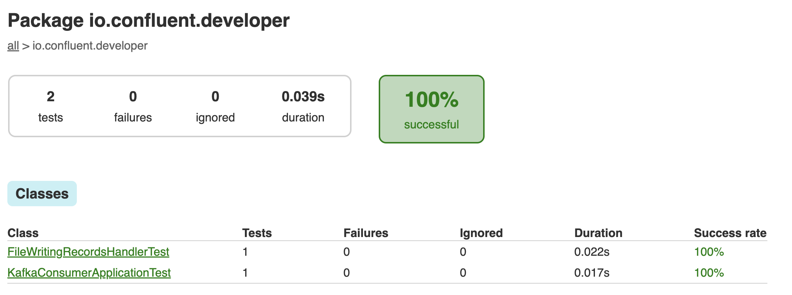

# Kafka Consumer Application

Let's build a simple application that uses a `KafkaConsumer` to read records from Kafka.

## Create a Consumer

There are required propertied needed to create a Kafka Consumer. At a minimum, the `Consumer` needs to know:
* How to find the Kafka broker(s).
* How to deserialize the key and value of events.
* A group id value for consumer group coordination.

```java annotate
  final String bootstrapServers = "localhost:9092";
  final String consumerGroupId = "my-group-id";
  final Properties consumerAppProps = new Properties() {{
        put(ConsumerConfig.BOOTSTRAP_SERVERS_CONFIG, bootstrapServers);
        put(ConsumerConfig.KEY_DESERIALIZER_CLASS_CONFIG, StringDeserializer.class);
        put(ConsumerConfig.VALUE_DESERIALIZER_CLASS_CONFIG, StringDeserializer.class);
        put(ConsumerConfig.GROUP_ID_CONFIG, consumerGroupId);
        put(ConsumerConfig.MAX_POLL_INTERVAL_MS_CONFIG, "500");
        put(ConsumerConfig.MAX_POLL_RECORDS_CONFIG, "2");
      }};
```

For more about Kafka Consumer Configurations, please [refer to the documentation](https://docs.confluent.io/platform/current/clients/consumer.html#ak-consumer-configuration).

## Consume Events

To consume a stream of events, the `Consumer` needs to subscribe to a topic (or multiple topics), and poll said topic(s)
to retrieve `ConsumerRecords`. In our example, we use an implementation of a `ConsumerRecordsHandler` to process the
`ConsumerRecords` from a poll interval.

```java annotate
  public void runConsume(final List<String> topicNames, final ConsumerRecordsHandler<String, String> recordsHandler) {
  try {
    consumer.subscribe(topicNames);
    while (keepConsuming) {
      final ConsumerRecords<String, String> consumerRecords = consumer.poll(Duration.ofSeconds(1));
      recordsHandler.process(consumerRecords);
    }
  } finally {
    consumer.close();
  }
}
```

The `FileWritingRecordsHandler` implementation iterates over the `ConsumerRecords` - which contains a collection of
`ConsumerRecord` objects. Each `ConsumerRecord` object encapsulates metadata and data for the events consumed from Kafka.
This includes the key, value, topic, partition, headers, offset, timestamp, and many others.

`FileWritingRecordsHandler` writes the `value` of each `ConsumerRecord` to a specified file name.

## Using This Example

<details>
<summary>Explore the Unit Tests</summary>

There are JUnit test cases in this repo to exercise the `Consumer` functionality.

Clone the `confluentinc/tutorials` GitHub repository (if you haven't already) and navigate to the `tutorials` directory:

```shell
git clone git@github.com:confluentinc/tutorials.git
cd tutorials
```

To run the unit tests, use the provided Gradle Wrapper:

```shell
./gradlew clean :kafka-consumer-application:kafka:test --info  
```

The results of the tests can be found in the `build/reports/index.html` report:



</details>

<details>
<summary>Execute the Application</summary>

This sample application will consume records from a Kafka topic and write them to a given file. You can run the 
example application in this tutorial using `confluent local`.

### Prerequisites
* [Confluent CLI](https://docs.confluent.io/confluent-cli/current/install.html)
* Docker running via [Docker Desktop](https://docs.docker.com/desktop/) or [Docker Engine](https://docs.docker.com/engine/install/)

### Start Kafka

* Execute `confluent local kafka start`  from a terminal window, and copy the `host:port` output.
```shell
The local commands are intended for a single-node development environment only, NOT for production usage. See more: https://docs.confluent.io/current/cli/index.html


Pulling from confluentinc/confluent-local
Digest: sha256:30763749f746295175d6c20b21495fd369b57ca3685175075763865fb6292f6f
Status: Image is up to date for confluentinc/confluent-local:latest
+-----------------+-------+
| Kafka REST Port | 8082  |
| Plaintext Ports | 50277 |
+-----------------+-------+
Started Confluent Local containers "9cec8b1127".
To continue your Confluent Local experience, run `confluent local kafka topic create <topic>` and `confluent local kafka topic produce <topic>`.
```

### Build Application

* Use the Gradle Wrapper provided to build the application.
```shell
./gradlew :kafka-consumer-application:kafka:shadowJar
```

### Execute

* Our application expects 3 input parameters:
    * The Kafka broker `host:port` - per the `confluent local` step.
    * Consumer Group ID
    * Path to an output file, used by the `ConsumerRecordsHandler` implementation.

```shell
java -jar kafka-consumer-application/kafka/build/libs/kafka-consumer-application-standalone-0.0.1.jar localhost:50277 consumer1 ~/tmp/consumer.out  
```

### Publish Events to Kafka

* Use `confluent local kafka` to publish events to the `input-topic` Kafka topic to be consumed by the application.
```shell
confluent local kafka topic produce input-topic
```

* Input the string values you want written to Kafka.
```shell
the quick brown fox
jumped over
the lazy dog
Go to Kafka Summit
All streams lead
to Kafka
```

### Check the Output File

* Have a look at the output file specified in the input parameters - in our command above that would be `~/tmp/consumer.out`.

#### MacOS/Linux
```shell
tail -100 <filename>
```

#### Powershell/Windows
```shell
Get-Content <filename> -Tail 100
```

### Cleanup

* Stop local Kafka broker using `confluent local kafka stop`.

</details>