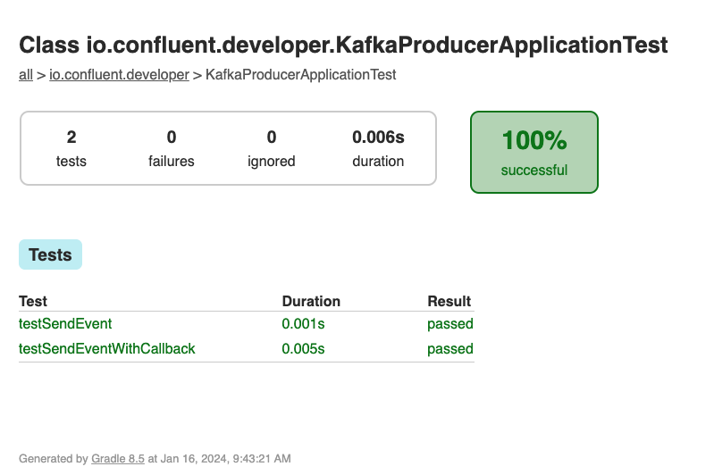

<!-- title: How to create a Kafka producer application in Java -->
<!-- description: In this tutorial, learn how to create a Kafka producer application in Java, with step-by-step instructions and supporting code. -->

# How to create a Kafka producer application in Java

An Apache Kafka® `Producer` is a client application that publishes (writes) events to a Kafka cluster.

The KafkaProducer class implements multiple `send` methods, allowing the caller to provide `Callback` behavior once
the event is sent to a Kafka topic. This tutorial will cover examples of both implementations.

## Create a Producer and ProducerRecord

There are required properties needed to create a Kafka Producer. At a minimum, the `Producer` needs to know:
* How to find the Kafka broker(s).
* How to serialize the key and value of events.

```java annotate
  final String bootstrapServers = "localhost:9092";
  Properties properties = new Properties() {{
      put(ProducerConfig.BOOTSTRAP_SERVERS_CONFIG, bootstrapServers);
      put(ProducerConfig.KEY_SERIALIZER_CLASS_CONFIG, StringSerializer.class);
      put(ProducerConfig.VALUE_SERIALIZER_CLASS_CONFIG, StringSerializer.class);
      put(ProducerConfig.ACKS_CONFIG, "1");
  }};
  
  Producer<String, String> producer = new KafkaProducer<>(properties);
```

For more about Kafka Producer Configurations, please [refer to the documentation](https://docs.confluent.io/platform/current/installation/configuration/producer-configs.html).

To prepare an event to send, we create instances of `ProducerRecord` - which include the target topic, key and value, of the event
to be sent to Kafka.

```java annotate
    final String key = "...";
    final String value = "...";
    final String topic = "...";
    ProducerRecord<String, String> record = ProducerRecord<>(topic, key, value);
```

## Send, No Callback

Given our `ProducerRecord`, let's send this record via our `Producer`. 

```java annotate
    Future<RecordMetadata> result = producer.send(record);
```

## Send With Callback

There are times when an application may want a deeper understanding of what occurred when an event was sent to Kafka. In this
case we can utilize the implementation of the `send` method with a `Callback` function. 

The `Callback` provides a way of handling any actions you want to take on request completion asynchronously. Note that the 
`Callback` code executes on the producer’s I/O thread and any time consuming tasks could cause a delay in sending new 
records, so any code here should be designed to execute quickly.

Here is an example of a `Callback` - implemented as a lambda - that prints the offset and partition of the event sent to Kafka.

```java annotate
    Callback callback = (recordMetadata, e) -> 
      System.out.println("topic: " + recordMetadata.topic() + 
              "partition: , " + recordMetadata.partition() +
              "offset: , " + recordMetadata.offset());

    // use the callback with the `send` method...
    Future<RecordMetadata> result = producer.send(record, callback);
```

## Using This Example

<details>
<summary>Execute the Unit Tests</summary>

There are JUnit test cases in this repo, exercising examples of both implementations of the `send` method of `KafkaProducer`.

Clone the `confluentinc/tutorials` GitHub repository (if you haven't already) and navigate to the `tutorials` directory:

```shell
git clone git@github.com:confluentinc/tutorials.git
cd tutorials
```

To run the unit tests, use the provided Gradle Wrapper:

```shell
./gradlew clean :kafka-producer-application:kafka:test --info  
```

The results of the tests can be found in the `build/reports/index.html` report. Drill down using the links in the report,
you should see the results of `KafkaProducerApplicationTest`:



</details>

<details>
<summary>Run with Confluent Local</summary>

You can run the example application in this tutorial using `confluent local`.

### Prerequisites
* [Confluent CLI](https://docs.confluent.io/confluent-cli/current/install.html) 
* Docker running via [Docker Desktop](https://docs.docker.com/desktop/) or [Docker Engine](https://docs.docker.com/engine/install/)

### Start Kafka

* Execute `confluent local kafka start`  from a terminal window, and copy the `host:port` output.
```shell
The local commands are intended for a single-node development environment only, NOT for production usage. See more: https://docs.confluent.io/current/cli/index.html


Pulling from confluentinc/confluent-local
Digest: sha256:30763749f746295175d6c20b21495fd369b57ca3685175075763865fb6292f6f
Status: Image is up to date for confluentinc/confluent-local:latest
+-----------------+-------+
| Kafka REST Port | 8082  |
| Plaintext Ports | 65410 |
+-----------------+-------+
Started Confluent Local containers "9cec8b1127".
To continue your Confluent Local experience, run `confluent local kafka topic create <topic>` and `confluent local kafka topic produce <topic>`.
```

### Build Application

* Use the Gradle Wrapper provided to build the application.
```shell
./gradlew :kafka-producer-application:kafka:shadowJar
```

### Execute

* Our application expects 2 input parameters:
  * The Kafka broker `host:port` - per the `confluent local` step.
  * Path to our input file - provided in this repo as `kafka/input.txt`. 

* Our application loads the contents of the file and tokenizes each line into the `key` and `value` of an event to be sent to Kafka.

```text
1-value
2-words
3-All Streams
4-Lead to
```

* Execute the application using `java -jar...` with the required input parameters:
```shell
java -jar kafka-producer-application/kafka/build/libs/kafka-producer-application-standalone-0.0.1.jar localhost:65410 kafka-producer-application/kafka/input.txt
```

### Validate
* Use Confluent CLI to view the events on the `output-topic` - from the beginning, including the key.

```shell
confluent local kafka topic consume output-topic --from-beginning --print-key
1	value
2	words
3	All Streams
4	Lead to
5	Kafka
6	Go to
7	Kafka Summit
8	How can
9	a 10 ounce
10	bird carry a
11	5lb coconut
```

### Cleanup

* Stop local Kafka broker using `confluent local kafka stop`.

</details>