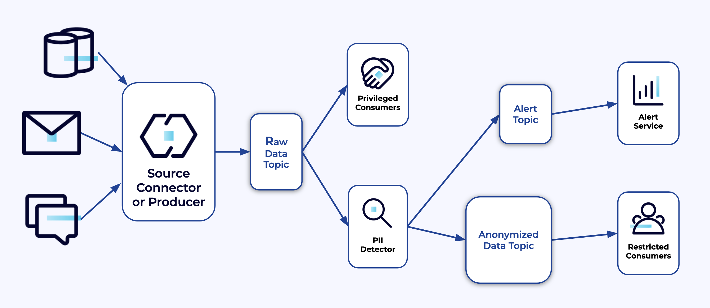

# Run a PII Detection streaming app using Microsoft Presidio and Natural Language Processing

## Intro

This PII Detection demo application is using python, faust, Microsoft presidio and other libraries to automatically detect and redact PII information in Kafka messages.

A common topology is to go through a raw data topic that is accessible by priviledged consumers and at the same time use a PII detection application to send the data, after analysis and redaction, into an anonymized data topic. 

The app also sends alerts into a topic with the details of where data has been redacted.

Unpriviledged consumers, that don't have enough rights to read the full data, can consume the anonymized messages.

For reference: 
- PII Detection slides : https://docs.google.com/presentation/d/1qgJ-_1_ifXjG9sgM__d7s5Z-LOfMqNDZwCrsjItI3xw/
- Python tools slides: https://docs.google.com/presentation/d/1cdfVa2A5FQXwo5Oxi9FUEscQp2z78SAo5xfvjNNZhIg/

## Running PII Detection

To send data to the source topics, we use a sample producer but any data source will work of course.
The PII detection app is a faust python app that uses libraries that we have developed using Microsoft Presidio and other tools to read from the source topics, inspect the messages and redact them if PII is detected.

### Prepare the python environment

With python 3.6 or later installed/available on your system:

- Open a terminal and go to the tutorial folder
- run the `create_py_env.sh` script with `source`: `source ./create_py_env.sh` 

This will create a python virtual environment and load the required libraries in it. The environment is created in a folder named `venv` in the current directory. There is a variable that you can change in the script if you want to put it somewhere else. The environment can be safely deleted and recreated at will.

### Connecting to a Confluent Cloud cluster

Credentials to the CC cluster can be entered inside a `.ini` or `.env` file or passed as environment variables. Envvars take precedence. We have provided a `settings.ini` that you can supplement easily. The 1st 6 lines have to be provided (CC URL, key and secret + SR URL, key and secret). 

- Move to the `code` folder: `cd code`
- Open `settings.ini`
- Enter your CC credentials
- That's it!

### Run the producer

(You should already be in the `code` folder.)

`python message_producer.py`

This will produce fake data into a topic named `demo-raw` in your Confluent Cloud cluster. You should see messages coming into the topic and some messages will have PII in them.

### Run the streaming app

- Open a new terminal and go the tutorial folder.
- Move to the `code` folder: `cd code`
- Activate the environment: `source ../pii-detection-tutorial-venv/bin/activate`
- Ru the app: `python app.py worker -l info`

As the app runs, you should see messages going to the `demo-anon` topic (with the PII redacted) and for each redaction, there will be an alert message in the `demo-alerts` topic. 

## Customization points and improving the detection rate

The `settings.ini` file contains a few customization options:
- `LANGUAGES`: it's important to provide an accurate list of the languages used in the messages. It helps with the syntactic analysis of the sentences contained in the messages.
- `MODELS`: NLP models loaded are derived from the expected languages but different sizes are available for each language. If you can use the largest ones. See https://spacy.io/usage/models 
- `ENTITY_TYPES`: they are the type of data that is detected (credit card, postal code, name, etc). You can provide a list to supplement or replace the default list. Entities are described here: https://microsoft.github.io/presidio/supported_entities/
- `IGNORE_FIELD_TAGS`: you can provide here a list of field tags to be skipped. If the list is empty it will look at all the text fields.

The settings file also shows declaring an external `yaml` file with extra recognizers. They can be used to improve recognition of specific entity types or words.

Factors impacting the PII detection:
- The longer and the more formed the sentences are, the better will be the syntactic analysis done by the NLP models. From there, when a sentence is properly analyzed, differentiating words that could be part of PII or just be common words works better.
- Short malformed sentences such as chat exchanges will have a lower detection performance. Loading larger models in this situation will improve results.
- Language detection can be done automatically (`LANGUAGES` left empty or set to `auto`) but works better with more words (from the language). If the sentences are very short and few, it is better (when practical) to provide the list of possible languages.

