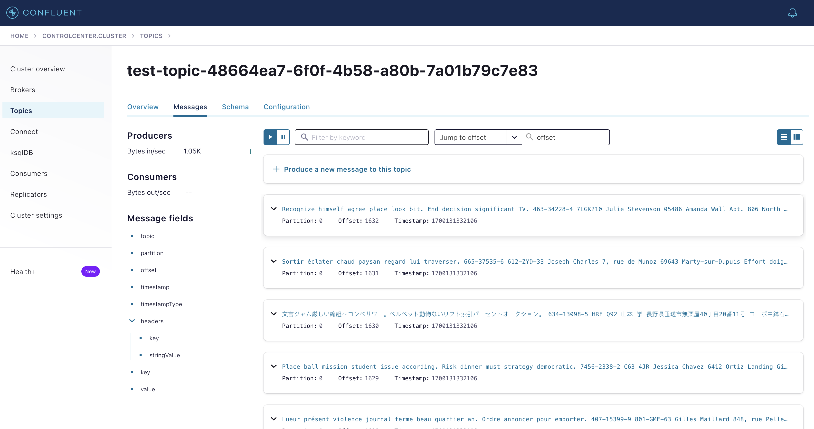
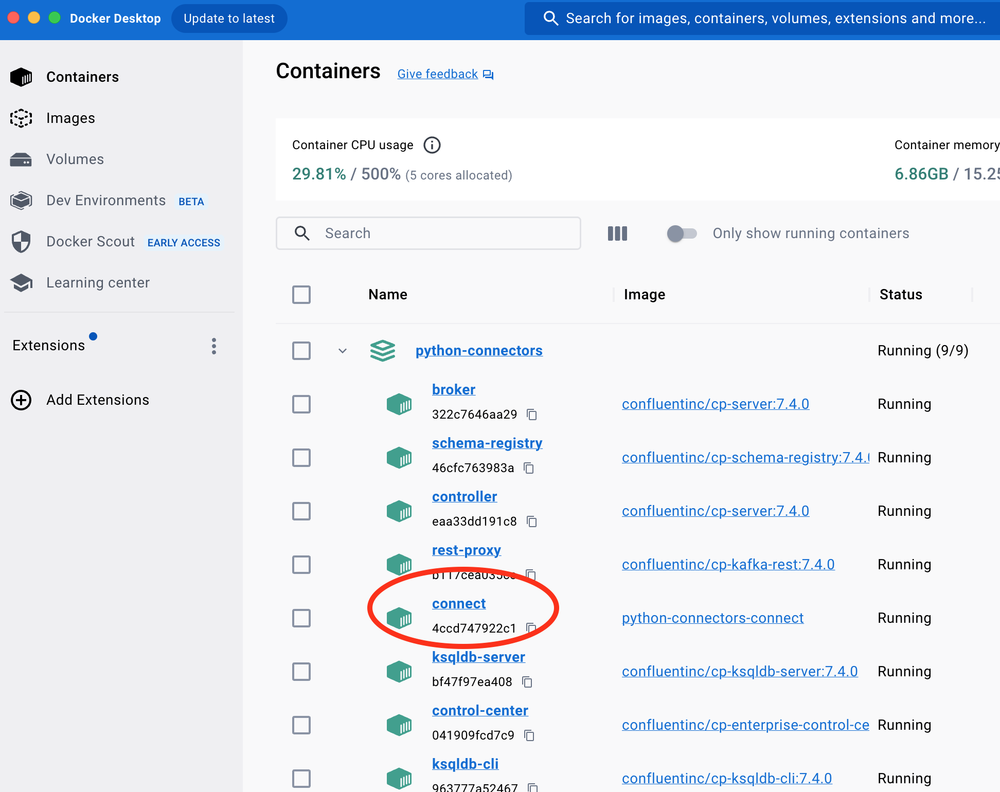
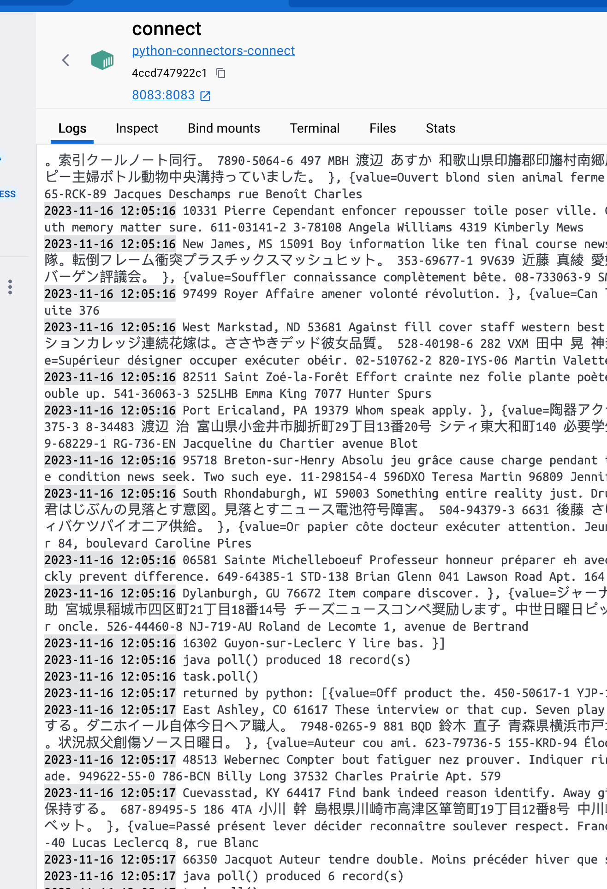

# Running Python source connectors and SMTs

## Intro

CSID Labs have developed tools and libraries that allow you to write and run Python source connectors and SMTs.

In addition to letting you use your favourite language (Python), they are also very simple to use. You can write a `Hello World` source connector with just 2 lines of code.

More details:
- Source: [github.com/confluentinc/csid-python-base](https://github.com/confluentinc/csid-python-base)
- [How it works - Overview Slides](./Using-Python-in-Connectors-and-SMTs.pdf)

## Running a Python source connector

This tutorial uses a complete cluster running on `docker`. Just make sure you have Docker Desktop installed on your computer and you're ready to go!

### Start the cluster

1. Open a terminal and go to the tutorial folder - python-connectors.
2. Start the cluster: `docker-compose up -d`
3. Wait for a few seconds and run: `docker-compose ps`. Everything container instance should be marked as running.  

### Start a connector and an SMT

From there, you have to create a connector in the Connect cluster.  

There are 3 examples provided with this tutorial in the `json`folder. They all use a Python connector and the last one also includes a Python SMT.

1. [connector-fields.json](json/connector-fields.json): this example publishes JSON messages containing 6 fields. This corresponds to the `code/speed_traps.py` script.
2. [connector-full-text.json](json/connector-full-text.json): this example publishes messages with one big string as the value. This is in the `code/full_text.py` script.
3. [connector-with-smt.json](json/connector-with-smt.json): this example publishes simple messages and the same script also contains an SMT that is modifying the messages. It can be found in the `code/connector_with_smt.py` script.

To create a connector you can use `curl` or you can use the Control Center UI. Since we already have a terminal open, let's use that. Wait a minute or two while the Connect container initializes. If you get a 404 error when running the command below, wait a little bit more and try again.

Run `curl localhost:8083/connectors -X POST --json @./json/connector-fields.json` to create a connector with the example 1 above.

To check that everything is running you can either:
- Open Control Center at http://localhost:9021 and go to the Topics panel. Select the topic starting with `test-topic` and click on the Messages tab. If your Docker environment is slow, you may have to wait a few minutes for the test topic to show up. When it does, you should see messages coming in.
  

- Open the Docker Desktop dashboard, expand the cluster, click on the `connect` container.
  
  The Logs tab should list messages being published by the connector and modified by the SMT if there's one. 
  

### Note on SMTs

SMTs are functions that transform the messages before they are saved into the source topic by the source connector. 

They receive the messages with some context and return the transformed (or not) messages. They can even return `None` to filter messages out (in other words, those won't be saved into the input topic). 

In our example (no 3 above), the connector and the SMT are on the same script. This is for convenience but not mandatory at all. As a matter of fact, in the vast majority of the case, the SMTs will be fully separated from the connectors.

## Configuration Properties and Technical Details

When you submit a json file to create a connector, it includes some settings for the Python connector.
The main one is the `entry.point` property that is telling the connector which Python script to use and which method to call repeatedly.
(Usually this method is called `poll` but it can be anything.)

All the configuration properties and the technical are described in the [tech-details.md](./tech-details.md) file. 
