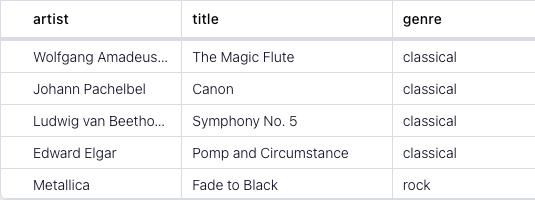

<!-- title: How to aggregate over session windows with Flink SQL -->
<!-- description: In this tutorial, learn how to aggregate over session windows with Flink SQL, with step-by-step instructions and supporting code. -->

# How aggregate over session windows with Flink SQL

If you have time series events in a Kafka topic, session windows let you group and aggregate them into variable-size, non-overlapping time intervals based on a configurable inactivity period.

For example, suppose that you have a topic with events that represent website clicks and you'd like track user behavior on your site.  Session windows are different from fixed-size windows (tumbling or hopping) because the start and end of the window is determined solely by the event timestamps, and they aren't fixed in size.  As long as there is an event within a defined inactivity gap, the window will continue to grow.

## Setup

Let's assume the following DDL for tracking user click activity:

```sql
CREATE TABLE clicks (
    ip STRING,
    url STRING,
    click_ts TIMESTAMP(3),
  -- declare ts as event time attribute and use strictly ascending timestamp watermark strategy
    WATERMARK FOR click_ts AS click_ts
);
```

The timestamp is an important attribute since we’ll be modeling user behavior and how many pages they view in a given session.
Also, because we are going to aggregate over time windows, we must define a watermark strategy. In this case, we use
strictly ascending timestamps, i.e., any row with a timestamp that is less than or equal to the latest observed event
timestamp is considered late and ignored.

## Compute the windowed aggregation

Given the `clicks` table definition above, let’s figure out how many pages a user visits in a session.  You'll define an inactivity gap of 2 minutes to mark the end of a session.  Otherwise, as users continue to click within 5 minutes, the existing session will continue to grow. 
Let's observe user click behavior using a [session windowed table-valued function (TVF)](https://nightlies.apache.org/flink/flink-docs-release-1.19/docs/dev/table/sql/queries/window-tvf/#session).

```sql
SELECT url,
    COUNT(url) AS visited_count,
    window_start,
    window_end
FROM TABLE(SESSION(TABLE clicks PARTITION BY url, DESCRIPTOR(click_ts), INTERVAL '2' MINUTES))
GROUP BY url, window_start, window_end;
```

## Running the example

You can run the example backing this tutorial in one of three ways: a Flink Table API-based JUnit test, locally with the Flink SQL Client 
against Flink and Kafka running in Docker, or with Confluent Cloud.

<details>
  <summary>Flink Table API-based test</summary>

  #### Prerequisites

  * Java 17, e.g., follow the OpenJDK installation instructions [here](https://openjdk.org/install/) if you don't have Java. 
  * Docker running via [Docker Desktop](https://docs.docker.com/desktop/) or [Docker Engine](https://docs.docker.com/engine/install/)

  #### Run the test

Run the following command to execute [FlinkSqlMergeTablesTest#testMerge](src/test/java/io/confluent/developer/FlinkSqlMergeTablesTest.java):

  ```plaintext
  ./gradlew clean :session-windows:flinksql:test
  ```

  The test starts Kafka and Schema Registry with [Testcontainers](https://testcontainers.com/), runs the Flink SQL commands
  above against a local Flink `StreamExecutionEnvironment`, and ensures that the routed results are what we expect.
</details>

<details>
  <summary>Flink SQL Client CLI</summary>

  #### Prerequisites

  * Docker running via [Docker Desktop](https://docs.docker.com/desktop/) or [Docker Engine](https://docs.docker.com/engine/install/)
  * [Docker Compose](https://docs.docker.com/compose/install/). Ensure that the command `docker compose version` succeeds.

  #### Run the commands

  First, start Flink and Kafka:

  ```shell
  docker compose -f ./docker/docker-compose-flinksql.yml up -d
  ```

  Next, open the Flink SQL Client CLI:

  ```shell
  docker exec -it flink-sql-client sql-client.sh
  ```

  Finally, run following SQL statements to create the `clicks` table backed by Kafka running in Docker, populate them with
  test data, and then run a statement displaying the session windows.

  ```sql
  CREATE TABLE clicks (
            ip STRING,
            url STRING,
            click_ts TIMESTAMP(3),
            WATERMARK FOR click_ts AS click_ts
  ) WITH (
      'connector' = 'kafka',
      'topic' = 'clicks',
      'connector' = 'kafka',
      'properties.bootstrap.servers' = 'broker:9092',
      'scan.startup.mode' = 'earliest-offset',
      'key.format' = 'raw',
      'key.fields' = 'ip',
      'value.format' = 'json',
      'value.fields-include' = 'EXCEPT_KEY'
  );
 ``` 
```sql
 INSERT INTO clicks VALUES
        ('9.62.201.241','/acme/jeep-stuff/', TO_TIMESTAMP('2023-07-09 01:00:00')),
        ('122.65.213.141', '/farm-for-all/chickens/', TO_TIMESTAMP('2023-07-09 02:00:10')),
        ('122.65.213.141', '/farm-for-all/chickens/', TO_TIMESTAMP('2023-07-09 02:00:20')),
        ('122.65.213.141', '/farm-for-all/chickens/', TO_TIMESTAMP('2023-07-09 02:01:00')),
        ('9.62.201.241', '/acme/jeep-stuff/', TO_TIMESTAMP('2023-07-09 01:00:30')),
        ('9.62.201.241', '/acme/jeep-stuff/', TO_TIMESTAMP('2023-07-09 01:01:00')),
        ('21.229.87.11', '/amc-rio/movies/', TO_TIMESTAMP('2023-07-09 09:00:00')),
        ('234.112.107.50', '/trips/packages/', TO_TIMESTAMP('2023-07-09 12:00:00')),
        ('21.229.87.11', '/amc-rio/movies/', TO_TIMESTAMP('2023-07-09 09:00:30')),
        ('122.65.213.141', '/farm-for-all/tractors/', TO_TIMESTAMP('2023-07-09 02:30:00')),
        ('122.65.213.141', '/farm-for-all/tractors/', TO_TIMESTAMP('2023-07-10 02:31:00'));
```
```sql
SELECT url,
    COUNT(url) AS visited_count,
    window_start,
    window_end
FROM TABLE(SESSION(TABLE clicks PARTITION BY url, DESCRIPTOR(click_ts), INTERVAL '2' MINUTES))
GROUP BY url, window_start, window_end;
```

  The query output should look like this:

  ```plaintext
              url              visited_count                           window_start                window_end      
/acme/jeep-stuff/                       3                  2023-07-09 01:00:00.000   2023-07-09 01:03:00.000
/farm-for-all/chickens/                 3                  2023-07-09 02:00:10.000   2023-07-09 02:03:00.000
/farm-for-all/tractors/                 1                  2023-07-09 02:30:00.000   2023-07-09 02:32:00.000
/amc-rio/movies/                        2                  2023-07-09 09:00:00.000   2023-07-09 09:02:30.000
/trips/packages/                        1                  2023-07-09 12:00:00.000   2023-07-09 12:02:00.000
  ```

  When you are finished, clean up the containers used for this tutorial by running:

  ```shell
  docker compose -f ./docker/docker-compose-flinksql.yml down
  ```

</details>

<details>
  <summary>Confluent Cloud</summary>

  #### Prerequisites

  * A [Confluent Cloud](https://confluent.cloud/signup) account
  * A Flink compute pool created in Confluent Cloud. Follow [this](https://docs.confluent.io/cloud/current/flink/get-started/quick-start-cloud-console.html) quick start to create one.

  #### Run the commands

  In the Confluent Cloud Console, navigate to your environment and then click the `Open SQL Workspace` button for the compute
  pool that you have created.

  Select the default catalog (Confluent Cloud environment) and database (Kafka cluster) to use with the dropdowns at the top right.

Finally, run following SQL statements to create the `clicks` table backed by Kafka running in Docker, populate them with
test data, and then run a statement displaying the session windows.

  ```sql
  CREATE TABLE clicks (
            ip STRING,
            url STRING,
            click_ts TIMESTAMP(3),
            WATERMARK FOR click_ts AS click_ts
  );
 ``` 
```sql
 INSERT INTO clicks VALUES
        ('9.62.201.241','/acme/jeep-stuff/', TO_TIMESTAMP('2023-07-09 01:00:00')),
        ('122.65.213.141', '/farm-for-all/chickens/', TO_TIMESTAMP('2023-07-09 02:00:10')),
        ('122.65.213.141', '/farm-for-all/chickens/', TO_TIMESTAMP('2023-07-09 02:00:20')),
        ('122.65.213.141', '/farm-for-all/chickens/', TO_TIMESTAMP('2023-07-09 02:01:00')),
        ('9.62.201.241', '/acme/jeep-stuff/', TO_TIMESTAMP('2023-07-09 01:00:30')),
        ('9.62.201.241', '/acme/jeep-stuff/', TO_TIMESTAMP('2023-07-09 01:01:00')),
        ('21.229.87.11', '/amc-rio/movies/', TO_TIMESTAMP('2023-07-09 09:00:00')),
        ('234.112.107.50', '/trips/packages/', TO_TIMESTAMP('2023-07-09 12:00:00')),
        ('21.229.87.11', '/amc-rio/movies/', TO_TIMESTAMP('2023-07-09 09:00:30')),
        ('122.65.213.141', '/farm-for-all/tractors/', TO_TIMESTAMP('2023-07-09 02:30:00')),
        ('122.65.213.141', '/farm-for-all/tractors/', TO_TIMESTAMP('2023-07-10 02:31:00'));
```
```sql
SELECT url,
    COUNT(url) AS visited_count,
    window_start,
    window_end
FROM TABLE(SESSION(TABLE clicks PARTITION BY url, DESCRIPTOR(click_ts), INTERVAL '2' MINUTES))
GROUP BY url, window_start, window_end;
```


  The scrollable query output should start like this:

  
