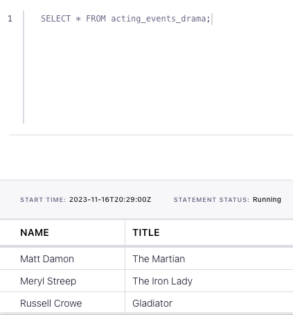

<!-- title: How to split a stream of events into substreams with Flink SQL -->
<!-- description: In this tutorial, learn how to split a stream of events into substreams with Flink SQL, with step-by-step instructions and supporting code. -->

# How to split a stream of events into substreams with Flink SQL

Suppose that you have a Kafka topic representing appearances of an actor or actress in a film, with each event denoting the genre. In this tutorial, we'll use Flink SQL to split the stream into substreams based on the genre. We'll have a topic for drama films, a topic for fantasy films, and a topic for everything else.

## Setup

Let's assume the following DDL for our base `acting_events` table:

```sql
CREATE TABLE acting_events (
    name STRING,
    title STRING,
    genre STRING
);
```

## Route events

Given the `acting_events` table definition above, we can create separate tables per genre and populate them as follows:

```sql

CREATE TABLE acting_events_drama (
    name STRING,
    title STRING,
    genre STRING
);
INSERT INTO acting_events_drama
    SELECT name, title
    FROM acting_events
    WHERE genre = 'drama';

CREATE TABLE acting_events_fantasy (
    name STRING,
    title STRING,
    genre STRING
);
INSERT INTO acting_events_fantasy
    SELECT name, title
    FROM acting_events
    WHERE genre = 'fantasy';

CREATE TABLE acting_events_other (
    name STRING,
    title STRING,
    genre STRING
);
INSERT INTO acting_events_other
    SELECT name, title
    FROM acting_events
    WHERE genre <> 'drama' AND genre <> 'fantasy';
```

## Running the example

You can run the example backing this tutorial in one of three ways: a Flink Table API-based JUnit test, locally with the Flink SQL Client 
against Flink and Kafka running in Docker, or with Confluent Cloud.

<details>
  <summary>Flink Table API-based test</summary>

  #### Prerequisites

  * Java 17, e.g., follow the OpenJDK installation instructions [here](https://openjdk.org/install/) if you don't have Java. 
  * Docker running via [Docker Desktop](https://docs.docker.com/desktop/) or [Docker Engine](https://docs.docker.com/engine/install/)

  #### Run the test

Run the following command to execute [FlinkSqlSplitStreamTest#testSplit](src/test/java/io/confluent/developer/FlinkSqlSplitStreamTest.java):

  ```plaintext
  ./gradlew clean :splitting:flinksql:test
  ```

  The test starts Kafka and Schema Registry with [Testcontainers](https://testcontainers.com/), runs the Flink SQL commands
  above against a local Flink `StreamExecutionEnvironment`, and ensures that the routed results are what we expect.
</details>

<details>
  <summary>Flink SQL Client CLI</summary>

  #### Prerequisites

  * Docker running via [Docker Desktop](https://docs.docker.com/desktop/) or [Docker Engine](https://docs.docker.com/engine/install/)
  * [Docker Compose](https://docs.docker.com/compose/install/). Ensure that the command `docker compose version` succeeds.

  #### Run the commands

  First, start Flink and Kafka:

  ```shell
  docker compose -f ./docker/docker-compose-flinksql.yml up -d
  ```

  Next, open the Flink SQL Client CLI:

  ```shell
  docker exec -it flink-sql-client sql-client.sh
  ```

  Finally, run following SQL statements to create the `acting_events` table backed by Kafka running in Docker, populate it with
  test data, and then create and populate a table for drama events.

  ```sql
  CREATE TABLE acting_events (
      name STRING,
      title STRING,
      genre STRING
  ) WITH (
      'connector' = 'kafka',
      'topic' = 'acting-events',
      'properties.bootstrap.servers' = 'broker:9092',
      'scan.startup.mode' = 'earliest-offset',
      'key.format' = 'avro-confluent',
      'key.avro-confluent.url' = 'http://schema-registry:8081',
      'key.fields' = 'name;title',
      'value.format' = 'avro-confluent',
      'value.avro-confluent.url' = 'http://schema-registry:8081',
      'value.fields-include' = 'ALL'
  );
  ```

  ```sql
  INSERT INTO acting_events VALUES
      ('Bill Murray', 'Ghostbusters', 'fantasy'),
      ('Christian Bale', 'The Dark Knight', 'crime'),
      ('Diane Keaton', 'The Godfather: Part II', 'crime'),
      ('Jennifer Aniston', 'Office Space', 'comedy'),
      ('Judy Garland', 'The Wizard of Oz', 'fantasy'),
      ('Keanu Reeves', 'The Matrix', 'fantasy'),
      ('Laura Dern', 'Jurassic Park', 'fantasy'),
      ('Matt Damon', 'The Martian', 'drama'),
      ('Meryl Streep', 'The Iron Lady', 'drama'),
      ('Russell Crowe', 'Gladiator', 'drama'),
      ('Will Smith', 'Men in Black', 'comedy');
  ```

  ```sql
  CREATE TABLE acting_events_drama (
      name STRING,
      title STRING
  )
  WITH (
      'connector' = 'kafka',
      'topic' = 'acting-events-drama',
      'properties.bootstrap.servers' = 'broker:9092',
      'scan.startup.mode' = 'earliest-offset',
      'key.format' = 'avro-confluent',
      'key.avro-confluent.url' = 'http://schema-registry:8081',
      'key.fields' = 'name;title',
      'value.format' = 'avro-confluent',
      'value.avro-confluent.url' = 'http://schema-registry:8081',
      'value.fields-include' = 'ALL'
  );
  ```

  ```sql
  INSERT INTO acting_events_drama
      SELECT name, title
      FROM acting_events
      WHERE genre = 'drama';
  ```

  ```sql
  SELECT * FROM acting_events_drama;
  ```

  The query output should look like this:

  ```plaintext
                           name                          title
                     Matt Damon                    The Martian
                   Meryl Streep                  The Iron Lady
                  Russell Crowe                      Gladiator
  ```

  When you are finished, clean up the containers used for this tutorial by running:

  ```shell
  docker compose -f ./docker/docker-compose-flinksql.yml down
  ```

</details>

<details>
  <summary>Confluent Cloud</summary>

  #### Prerequisites

  * A [Confluent Cloud](https://confluent.cloud/signup) account
  * A Flink compute pool created in Confluent Cloud. Follow [this](https://docs.confluent.io/cloud/current/flink/get-started/quick-start-cloud-console.html) quick start to create one.

  #### Run the commands

  In the Confluent Cloud Console, navigate to your environment and then click the `Open SQL Workspace` button for the compute
  pool that you have created.

  Select the default catalog (Confluent Cloud environment) and database (Kafka cluster) to use with the dropdowns at the top right.

  Finally, run following SQL statements to create the `acting_events` table, populate it with test data, create and populate a table for drama acting events, and query this derived table.

  ```sql
  CREATE TABLE acting_events (
      name STRING,
      title STRING,
      genre STRING
  );
  ```

  ```sql
  INSERT INTO acting_events VALUES
      ('Bill Murray', 'Ghostbusters', 'fantasy'),
      ('Christian Bale', 'The Dark Knight', 'crime'),
      ('Diane Keaton', 'The Godfather: Part II', 'crime'),
      ('Jennifer Aniston', 'Office Space', 'comedy'),
      ('Judy Garland', 'The Wizard of Oz', 'fantasy'),
      ('Keanu Reeves', 'The Matrix', 'fantasy'),
      ('Laura Dern', 'Jurassic Park', 'fantasy'),
      ('Matt Damon', 'The Martian', 'drama'),
      ('Meryl Streep', 'The Iron Lady', 'drama'),
      ('Russell Crowe', 'Gladiator', 'drama'),
      ('Will Smith', 'Men in Black', 'comedy');
  ```

  ```sql
  CREATE TABLE acting_events_drama (
      name STRING,
      title STRING
  );
  ```

  ```sql
  INSERT INTO acting_events_drama
      SELECT name, title
      FROM acting_events
      WHERE genre = 'drama';
  ```

  ```sql
  SELECT * FROM acting_events_drama;
  ```

  The query output should look like this:

  
