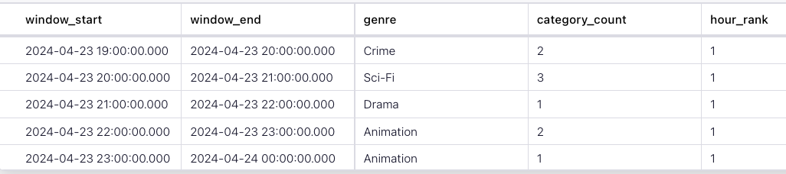

<!-- title: How to get the top (or bottom) N events per-time window with Flink SQL -->
<!-- description: In this tutorial, learn how to get the top (or bottom) N events per-time window with Flink SQL, with step-by-step instructions and supporting code. -->

# How to get the top (or bottom) N events per-time window with Flink SQL

The Top-N functionality in Flink SQL is excellent for tracking the top (or bottom) records in an event stream.  But what if you wanted the top records within distinct time ranges?  For example, consider you work for a video streaming service like Netflix or Hulu.  You need to see the top genre of movies subscribers watch by the hour to make more accurate recommendations.  To do this ranking by hour, you can use a [Windowed Top-N query](https://nightlies.apache.org/flink/flink-docs-release-1.19/docs/dev/table/sql/queries/window-topn/) and [windowing table-valued functions](https://nightlies.apache.org/flink/flink-docs-release-1.19/docs/dev/table/sql/queries/window-tvf/).

## Setup

Let's assume the following DDL for our base `movie_views` table:

```sql
TABLE movie_views (
        id INT,
        title STRING,
        genre STRING,
        movie_start TIMESTAMP(3),
        WATERMARK FOR movie_start as movie_start
)
```

## Compute the Windowed Top-N

Given the `movie_views` table definition above, we can retrieve the top genre by hour with this query.

```sql
SELECT  *
FROM (
       SELECT *, ROW_NUMBER() OVER (PARTITION BY window_start, window_end ORDER BY category_count DESC ) as hour_rank
       FROM (
              SELECT window_start, window_end, genre, COUNT(*) as category_count
                 FROM TABLE(TUMBLE(TABLE movie_views, DESCRIPTOR(movie_start), INTERVAL '1' HOUR))
              GROUP BY window_start, window_end, genre
            )
) WHERE hour_rank = 1 ;
```
 
There are a few moving parts to this query, so let's break it down starting from the inside and working our way out.

The innermost query is a [TUMBLE windowing tvf](https://nightlies.apache.org/flink/flink-docs-release-1.19/docs/dev/table/sql/queries/window-tvf/#tumble) that selects the window start, window end, genre and a count of genre for each movie started in a 1-hour tumbling window.

```sql
SELECT window_start, window_end, genre, COUNT(*) as category_count
    FROM TABLE(TUMBLE(TABLE movie_views, DESCRIPTOR(movie_start), INTERVAL '1' HOUR))
GROUP BY window_start, window_end, genre
```

Working our way out to the next query, it selects all results from the tumbling window query.  It performs an [over aggregation](https://nightlies.apache.org/flink/flink-docs-release-1.19/docs/dev/table/sql/queries/over-agg/) partitioning results by the window start and window end and ordering them (descending) by the count.  This query gives us the rank of movies by genre started each hour.

```sql
 SELECT *, SELECT *, ROW_NUMBER() OVER (PARTITION BY window_start, window_end ORDER BY category_count DESC )
       FROM ( 
           ....
        )
```

The outermost query selects all results from the `OVER` aggregation where the `hour_rank` column equals 1, indicating it was the top genre of the movie that started in that hour.

```sql
SELECT  *
     FROM ( .... )
WHERE hour_rank = 1 ;
```

Here are some essential concepts used to calculate the windowed Top-N results

1. `ROW_NUMBER()`, starting at one, assigns a unique, sequential number to each row representing its place in the result set, which we've labeled `hour_rank.`
2. `PARTITION BY` specifies how to partition the data. Using a partition of window starting and ending, you'll rank the movie genres in each 1-hour tumbling window.
3. `ORDER BY` orders results by the number calculated by the `ROW_NUMBER()` function which is its position in the window.

## Running the example

You can run the example backing this tutorial in one of three ways: a Flink Table API-based JUnit test, locally with the Flink SQL Client 
against Flink and Kafka running in Docker, or with Confluent Cloud.

<details>
  <summary>Flink Table API-based test</summary>

  #### Prerequisites

  * Java 17, e.g., follow the OpenJDK installation instructions [here](https://openjdk.org/install/) if you don't have Java. 
  * Docker running via [Docker Desktop](https://docs.docker.com/desktop/) or [Docker Engine](https://docs.docker.com/engine/install/)

  #### Run the test

Run the following command to execute [FlinkSqlTopNTest#testTopN](src/test/java/io/confluent/developer/FlinkSqlTopNTest.java):

  ```plaintext
  ./gradlew clean :windowed-top-N:flinksql:test
  ```

  The test starts Kafka and Schema Registry with [Testcontainers](https://testcontainers.com/), runs the Flink SQL commands
  above against a local Flink `StreamExecutionEnvironment`, and ensures that the aggregation results are what we expect.
</details>

<details>
  <summary>Flink SQL Client CLI</summary>

  #### Prerequisites

  * Docker running via [Docker Desktop](https://docs.docker.com/desktop/) or [Docker Engine](https://docs.docker.com/engine/install/)
  * [Docker Compose](https://docs.docker.com/compose/install/). Ensure that the command `docker compose version` succeeds.

  #### Run the commands

  First, start Flink and Kafka:

  ```shell
  docker compose -f ./docker/docker-compose-flinksql.yml up -d
  ```

  Next, open the Flink SQL Client CLI:

  ```shell
  docker exec -it flink-sql-client sql-client.sh
  ```

  Finally, run following SQL statements to create the `movie_views` table backed by Kafka running in Docker, populate it with
  test data, and run the Top-N query.

  ```sql
  CREATE TABLE movie_views (
            id INT,
            title STRING,
            genre STRING,
            movie_start TIMESTAMP(3),
            WATERMARK FOR movie_start as movie_start
  ) WITH (
      'connector' = 'kafka',
      'topic' = 'movie_views',
      'properties.bootstrap.servers' = 'broker:9092',
      'scan.startup.mode' = 'earliest-offset',
      'key.format' = 'raw',
      'key.fields' = 'id',
      'value.format' = 'json',
      'value.fields-include' = 'EXCEPT_KEY'
);

  ```

  ```sql
  INSERT INTO movie_views (id, title, genre, movie_start)
  VALUES (123, 'The Dark Knight', 'Action', TO_TIMESTAMP('2024-04-23 19:04:00')),
         (456, 'Avengers: Endgame', 'Action', TO_TIMESTAMP('2024-04-23 22:01:00')),
         (789, 'Inception', 'Sci-Fi', TO_TIMESTAMP('2024-04-23 20:24:00')),
         (147, 'Joker', 'Drama', TO_TIMESTAMP('2024-04-23 22:56:00')),
         (258, 'The Godfather', 'Crime', TO_TIMESTAMP('2024-04-23 19:13:00')),
         (369, 'Casablanca', 'Romance', TO_TIMESTAMP('2024-04-23 20:26:00')),
         (321, 'The Shawshank Redemption', 'Drama', TO_TIMESTAMP('2024-04-23 20:20:00')),
         (654, 'Forrest Gump', 'Drama', TO_TIMESTAMP('2024-04-23 21:54:00')),
         (987, 'Fight Club', 'Drama', TO_TIMESTAMP('2024-04-23 23:24:00')),
         (135, 'Pulp Fiction', 'Crime', TO_TIMESTAMP('2024-04-23 22:09:00')),
         (246, 'The Godfather: Part II', 'Crime', TO_TIMESTAMP('2024-04-23 19:28:00')),
         (357, 'The Departed', 'Crime', TO_TIMESTAMP('2024-04-23 23:11:00')),
         (842, 'Toy Story 3', 'Animation', TO_TIMESTAMP('2024-04-23 23:12:00')),
         (931, 'Up', 'Animation', TO_TIMESTAMP('2024-04-23 22:17:00')),
         (624, 'The Lion King', 'Animation', TO_TIMESTAMP('2024-04-23 22:28:00')),
         (512, 'Star Wars: The Force Awakens', 'Sci-Fi', TO_TIMESTAMP('2024-04-23 20:42:00')),
         (678, 'The Matrix', 'Sci-Fi', TO_TIMESTAMP('2024-04-23 19:25:00')),
         (753, 'Interstellar', 'Sci-Fi', TO_TIMESTAMP('2024-04-23 20:14:00')),
         (834, 'Titanic', 'Romance', TO_TIMESTAMP('2024-04-23 20:25:00')),
         (675, 'Pride and Prejudice', 'Romance', TO_TIMESTAMP('2024-04-23 23:37:00')),
         (333, 'The Pride of Archbishop Carroll', 'History', TO_TIMESTAMP('2024-04-24 03:37:00'));
  ```

```sql
SELECT  *
FROM (
       SELECT *, ROW_NUMBER() OVER (PARTITION BY window_start, window_end ORDER BY category_count DESC ) as hour_rank
       FROM (
              SELECT window_start, window_end, genre, COUNT(*) as category_count
                  FROM TABLE(TUMBLE(TABLE movie_views, DESCRIPTOR(movie_start), INTERVAL '1' HOUR))
              GROUP BY window_start, window_end, genre
        )
) WHERE hour_rank = 1 ;
  ```

  The query output should look like this:

  ```plaintext
              window_start         window_end         genre      category_count    hour_rank 
          2024-04-23 19:00:00  2024-04-23 20:00:00    Crime           2               1 
          2024-04-23 20:00:00  2024-04-23 21:00:00    Sci-Fi          3               1 
          2024-04-23 21:00:00  2024-04-23 22:00:00    Drama           1               1 
          2024-04-23 22:00:00  2024-04-23 23:00:00    Animation       2               1 
          2024-04-23 23:00:00  2024-04-24 00:00:00    Animation       1               1   
  ```

  When you are finished, clean up the containers used for this tutorial by running:

  ```shell
  docker compose -f ./docker/docker-compose-flinksql.yml down
  ```

</details>

<details>
  <summary>Confluent Cloud</summary>

  #### Prerequisites

  * A [Confluent Cloud](https://confluent.cloud/signup) account
  * A Flink compute pool created in Confluent Cloud. Follow [this](https://docs.confluent.io/cloud/current/flink/get-started/quick-start-cloud-console.html) quick start to create one.

  #### Run the commands

  In the Confluent Cloud Console, navigate to your environment and then click the `Open SQL Workspace` button for the compute
  pool that you have created.

  Select the default catalog (Confluent Cloud environment) and database (Kafka cluster) to use with the dropdowns at the top right.

  Finally, run following SQL statements to create the `movie_views` table, populate it with test data, and run the windowed Top-N query.

  ```sql
 CREATE TABLE movie_views (
        id INT,
        title STRING,
        genre STRING,
        movie_start TIMESTAMP(3),
        WATERMARK FOR movie_start as movie_start
 )
  ```

  ```sql
  INSERT INTO movie_views (id, title, genre, movie_start)
  VALUES (123, 'The Dark Knight', 'Action', TO_TIMESTAMP('2024-04-23 19:04:00')),
         (456, 'Avengers: Endgame', 'Action', TO_TIMESTAMP('2024-04-23 22:01:00')),
         (789, 'Inception', 'Sci-Fi', TO_TIMESTAMP('2024-04-23 20:24:00')),
         (147, 'Joker', 'Drama', TO_TIMESTAMP('2024-04-23 22:56:00')),
         (258, 'The Godfather', 'Crime', TO_TIMESTAMP('2024-04-23 19:13:00')),
         (369, 'Casablanca', 'Romance', TO_TIMESTAMP('2024-04-23 20:26:00')),
         (321, 'The Shawshank Redemption', 'Drama', TO_TIMESTAMP('2024-04-23 20:20:00')),
         (654, 'Forrest Gump', 'Drama', TO_TIMESTAMP('2024-04-23 21:54:00')),
         (987, 'Fight Club', 'Drama', TO_TIMESTAMP('2024-04-23 23:24:00')),
         (135, 'Pulp Fiction', 'Crime', TO_TIMESTAMP('2024-04-23 22:09:00')),
         (246, 'The Godfather: Part II', 'Crime', TO_TIMESTAMP('2024-04-23 19:28:00')),
         (357, 'The Departed', 'Crime', TO_TIMESTAMP('2024-04-23 23:11:00')),
         (842, 'Toy Story 3', 'Animation', TO_TIMESTAMP('2024-04-23 23:12:00')),
         (931, 'Up', 'Animation', TO_TIMESTAMP('2024-04-23 22:17:00')),
         (624, 'The Lion King', 'Animation', TO_TIMESTAMP('2024-04-23 22:28:00')),
         (512, 'Star Wars: The Force Awakens', 'Sci-Fi', TO_TIMESTAMP('2024-04-23 20:42:00')),
         (678, 'The Matrix', 'Sci-Fi', TO_TIMESTAMP('2024-04-23 19:25:00')),
         (753, 'Interstellar', 'Sci-Fi', TO_TIMESTAMP('2024-04-23 20:14:00')),
         (834, 'Titanic', 'Romance', TO_TIMESTAMP('2024-04-23 20:25:00')),
         (675, 'Pride and Prejudice', 'Romance', TO_TIMESTAMP('2024-04-23 23:37:00')),
         (333, 'The Pride of Archbishop Carroll', 'History', TO_TIMESTAMP('2024-04-24 03:37:00'));
  ```

  ```sql
  SELECT  *
  FROM (
         SELECT *, ROW_NUMBER() OVER (PARTITION BY window_start, window_end ORDER BY category_count DESC ) as hour_rank
         FROM (
                SELECT window_start, window_end, genre, COUNT(*) as category_count
                   FROM TABLE(TUMBLE(TABLE movie_views, DESCRIPTOR(movie_start), INTERVAL '1' HOUR))
                GROUP BY window_start, window_end, genre
        )
) WHERE hour_rank = 1 ;

  ```

  The query output should look like this:

  
